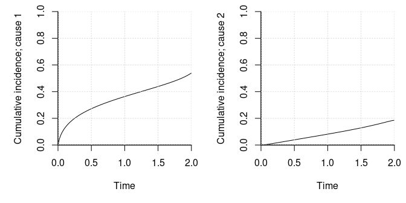
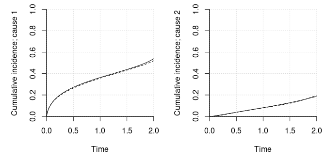
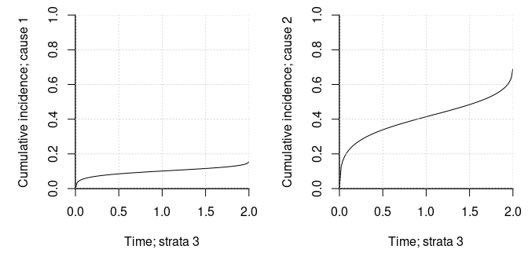
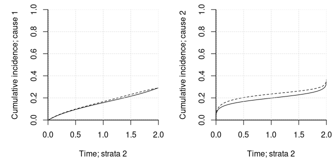
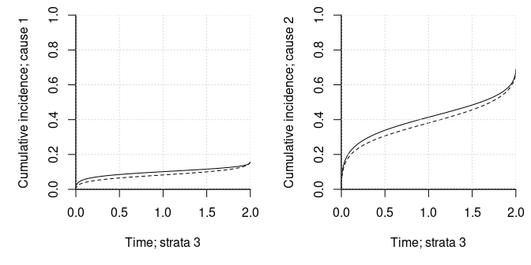
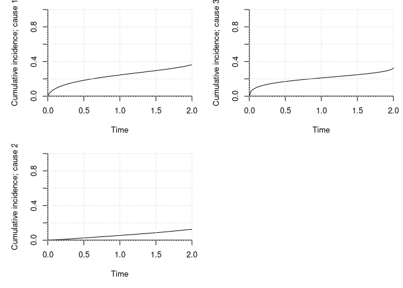
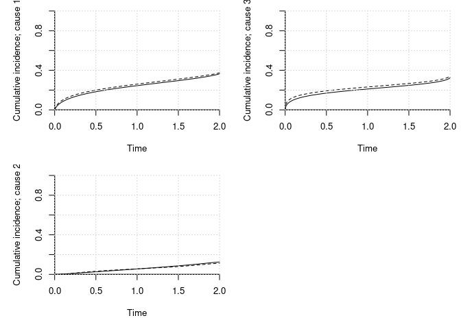

# MMCIF: Mixed Multivariate Cumulative Incidence Functions

[](https://github.com/boennecd/mmcif/actions)

This package provides an implementation of the model introduced by
Cederkvist et al. (2018) to model within-cluster dependence of both risk
and timing in competing risk. For interested readers, a vignette on
computational details can be found by calling
`vignette("mmcif-comp-details", "mmcif")`.

## Installation

The package can be installed from Github by calling

``` r
library(remotes)
install_github("boennecd/mmcif", build_vignettes = TRUE)
```

The code benefits from being build with automatic vectorization so
having e.g.  `-O3` in the `CXX17FLAGS` flags in your Makevars file may
be useful.

## The Model

The conditional cumulative incidence functions for cause
 of individual
 in cluster
 is

  
 &= \\pi_k(\\vec z_{ij}, \\vec u_i) \\Phi(-\\vec x_{ij}(t)^\\top\\vec\\gamma_k - \\eta_{ik}) \\\\ \\pi_k(\\vec z_{ij}, \\vec u_i) &= \\frac{\\exp(\\vec z_{ij}^\\top\\vec\\beta_k + u_{ik})}{1 + \\sum_{l = 1}^K\\exp(\\vec z_{ij}^\\top\\vec\\beta_l + u_{il})} \\\\ \\begin{pmatrix} \\vec U_i \\\\ \\vec\\eta_i \\end{pmatrix} &\\sim N^{(2K)}(\\vec 0;\\Sigma).\\end{align*}")  

where there are
 competing risks. The ^\\top\\vec\\gamma_k")’s for the trajectory must be
constrained to be monotonically decreasing in
. The covariates for the trajectory in this package are defined as

  
 = (\\vec h(t)^\\top, \\vec z_{ij}^\\top)^\\top")  

for a spline basis  and known covariates  which are also used in the risk part of the model.

## Example

We start with a simple example where there are  competing risks and

  
 &= \\left(\\text{arcthan}\\left(\\frac{t - \\delta/2}{\\delta/2}\\right), 1, a_{ij}, b_{ij}\\right) \\\\ a_{ij} &\\sim N(0, 1) \\\\
 b_{ij} &\\sim \\text{Unif}(-1, 1)\\\\ \\vec z_{ij} &= (1, a_{ij}, b_{ij}) \\end{align*}")  

We set the parameters below and plot the conditional cumulative
incidence functions when the random effects are zero and the covariates
are zero, .

``` r
# assign model parameters
n_causes <- 2L
delta <- 2

# set the betas
coef_risk <- c(.67, 1, .1, -.4, .25, .3) |> 
  matrix(ncol = n_causes)

# set the gammas
coef_traject <- c(-.8, -.45, .8, .4, -1.2, .15, .25, -.2) |> 
  matrix(ncol = n_causes)

# plot the conditional cumulative incidence functions when random effects and 
# covariates are all zero
local({
  probs <- exp(coef_risk[1, ]) / (1 + sum(exp(coef_risk[1, ])))
  par(mar = c(5, 5, 1, 1), mfcol = c(1, 2))
  
  for(i in 1:2){
    plot(\(x) probs[i] * pnorm(
      -coef_traject[1, i] * atanh((x - delta / 2) / (delta / 2)) - 
        coef_traject[2, i]),
         xlim = c(0, delta), ylim = c(0, 1), bty = "l",  xlab = "Time", 
         ylab = sprintf("Cumulative incidence; cause %d", i),
       yaxs = "i", xaxs = "i")
    grid()
  }
})
```



``` r

# set the covariance matrix
Sigma <- c(0.306, 0.008, -0.138, 0.197, 0.008, 0.759, 0.251, 
-0.25, -0.138, 0.251, 0.756, -0.319, 0.197, -0.25, -0.319, 0.903) |> 
  matrix(2L * n_causes)
```

Next, we assign a function to simulate clusters. The cluster sizes are
uniformly sampled from one to the maximum size. The censoring times are
drawn from a uniform distribution from zero to
.

``` r
library(mvtnorm)

# simulates a data set with a given number of clusters and maximum number of 
# observations per cluster
sim_dat <- \(n_clusters, max_cluster_size){
  stopifnot(max_cluster_size > 0,
            n_clusters > 0)
  
  cluster_id <- 0L
  apply(rmvnorm(n_clusters, sigma = Sigma), 1, \(rng_effects){
    U <- head(rng_effects, n_causes)
    eta <- tail(rng_effects, n_causes)
    
    n_obs <- sample.int(max_cluster_size, 1L)
    cluster_id <<- cluster_id + 1L
    
    # draw the cause
    covs <- cbind(a = rnorm(n_obs), b = runif(n_obs, -1))
    Z <- cbind(1, covs)
  
    cond_logits_exp <- exp(Z %*% coef_risk + rep(U, each = n_obs)) |> 
      cbind(1)
    cond_probs <- cond_logits_exp / rowSums(cond_logits_exp)
    cause <- apply(cond_probs, 1, 
                   \(prob) sample.int(n_causes + 1L, 1L, prob = prob))
    
    # compute the observed time if needed
    obs_time <- mapply(\(cause, idx){
      if(cause > n_causes)
        return(delta)
      
      # can likely be done smarter but this is more general
      coefs <- coef_traject[, cause]
      offset <- sum(Z[idx, ] * coefs[-1]) + eta[cause]
      rng <- runif(1)
      eps <- .Machine$double.eps
      root <- uniroot(
        \(x) rng - pnorm(
          -coefs[1] * atanh((x - delta / 2) / (delta / 2)) - offset), 
        c(eps^2, delta * (1 - eps)), tol = 1e-12)$root
    }, cause, 1:n_obs)
    
    cens <- runif(n_obs, max = 3 * delta)
    has_finite_trajectory_prob <- cause <= n_causes
    is_censored <- which(!has_finite_trajectory_prob | cens < obs_time)
    
    if(length(is_censored) > 0){
      obs_time[is_censored] <- pmin(delta, cens[is_censored])
      cause[is_censored] <- n_causes + 1L
    }
    
    data.frame(covs, cause, time = obs_time, cluster_id)
  }, simplify = FALSE) |> 
    do.call(what = rbind)
}
```

We then sample a data set.

``` r
# sample a data set
set.seed(8401828)
n_clusters <- 1000L
max_cluster_size <- 5L
dat <- sim_dat(n_clusters, max_cluster_size = max_cluster_size)

# show some stats
NROW(dat) # number of individuals
#> [1] 2962
table(dat$cause) # distribution of causes (3 is censored)
#> 
#>    1    2    3 
#> 1249  542 1171

# distribution of observed times by cause
tapply(dat$time, dat$cause, quantile, 
       probs = seq(0, 1, length.out = 11), na.rm = TRUE)
#> $`1`
#>        0%       10%       20%       30%       40%       50%       60%       70% 
#> 1.615e-05 4.918e-03 2.737e-02 9.050e-02 2.219e-01 4.791e-01 8.506e-01 1.358e+00 
#>       80%       90%      100% 
#> 1.744e+00 1.953e+00 2.000e+00 
#> 
#> $`2`
#>       0%      10%      20%      30%      40%      50%      60%      70% 
#> 0.001448 0.050092 0.157119 0.276072 0.431094 0.669010 0.964643 1.336520 
#>      80%      90%     100% 
#> 1.607221 1.863063 1.993280 
#> 
#> $`3`
#>       0%      10%      20%      30%      40%      50%      60%      70% 
#> 0.002123 0.246899 0.577581 1.007699 1.526068 2.000000 2.000000 2.000000 
#>      80%      90%     100% 
#> 2.000000 2.000000 2.000000
```

Then we setup the C++ object to do the computation.

``` r
library(mmcif)
comp_obj <- mmcif_data(
  ~ a + b, dat, cause = cause, time = time, cluster_id = cluster_id,
  max_time = delta, spline_df = 4L)
```

The `mmcif_data` function does not work with

  
 = \\text{arcthan}\\left(\\frac{t - \\delta/2}{\\delta/2}\\right)")  

but instead with )") where  returns a natural cubic spline basis functions. The knots are
based on quantiles of
") evaluated on the event times. The knots differ for each type of
competing risk. The degrees of freedom of the splines is controlled with
the `spline_df` argument. There is a `constraints` element on the object
returned by the `mmcif_data` function which contains matrices that
ensures that the ^\\top\\vec\\gamma_k")s are monotonically decreasing if
 where
 is one of matrices and
 is the concatenated vector of model parameters.

The time to compute the log composite likelihood is illustrated below.

``` r
NCOL(comp_obj$pair_indices) # the number of pairs in the composite likelihood
#> [1] 3911
length(comp_obj$singletons) # the number of clusters with one observation
#> [1] 202

# we need to find the combination of the spline bases that yield a straight 
# line to construct the true values using the splines. You can skip this
comb_slope <- sapply(comp_obj$spline, \(spline){
  boundary_knots <- spline$boundary_knots
  pts <- seq(boundary_knots[1], boundary_knots[2], length.out = 1000)
  lm.fit(cbind(1, spline$expansion(pts)), pts)$coef
})

# assign a function to compute the log composite likelihood
ll_func <- \(par, n_threads = 1L)
  mmcif_logLik(
    comp_obj, par = par, n_threads = n_threads, is_log_chol = FALSE)

# the log composite likelihood at the true parameters
coef_traject_spline <- 
  rbind(comb_slope[-1, ] * rep(coef_traject[1, ], each = NROW(comb_slope) - 1), 
        coef_traject[2, ] + comb_slope[1, ] * coef_traject[1, ],
        coef_traject[-(1:2), ])
true_values <- c(coef_risk, coef_traject_spline, Sigma)
ll_func(true_values)
#> [1] -7087

# check the time to compute the log composite likelihood
bench::mark(
  `one thread` = ll_func(n_threads = 1L, true_values),
  `two threads` = ll_func(n_threads = 2L, true_values),
  `three threads` = ll_func(n_threads = 3L, true_values),
  `four threads` = ll_func(n_threads = 4L, true_values), 
  min_time = 4)
#> # A tibble: 4 × 6
#>   expression         min   median `itr/sec` mem_alloc `gc/sec`
#>   <bch:expr>    <bch:tm> <bch:tm>     <dbl> <bch:byt>    <dbl>
#> 1 one thread      42.6ms   42.9ms      23.0        0B        0
#> 2 two threads     22.2ms   22.8ms      43.8        0B        0
#> 3 three threads   15.9ms   16.1ms      61.9        0B        0
#> 4 four threads    12.6ms   13.2ms      75.5        0B        0

# next, we compute the gradient of the log composite likelihood at the true 
# parameters. First we assign a few functions to verify the result. You can 
# skip these
upper_to_full <- \(x){
  dim <- (sqrt(8 * length(x) + 1) - 1) / 2
  out <- matrix(0, dim, dim)
  out[upper.tri(out, TRUE)] <- x
  out[lower.tri(out)] <- t(out)[lower.tri(out)]
  out
}
d_upper_to_full <- \(x){
  dim <- (sqrt(8 * length(x) + 1) - 1) / 2
  out <- matrix(0, dim, dim)
  out[upper.tri(out, TRUE)] <- x
  out[upper.tri(out)] <- out[upper.tri(out)] / 2
  out[lower.tri(out)] <- t(out)[lower.tri(out)]
  out
}

# then we can compute the gradient with the function from the package and with 
# numerical differentiation
gr_func <- function(par, n_threads = 1L)
  mmcif_logLik_grad(comp_obj, par, n_threads = n_threads, is_log_chol = FALSE)
gr_package <- gr_func(true_values)

true_values_upper <- 
  c(coef_risk, coef_traject_spline, Sigma[upper.tri(Sigma, TRUE)])
gr_num <- numDeriv::grad(
  \(x) ll_func(c(head(x, -10), upper_to_full(tail(x, 10)))), 
  true_values_upper, method = "simple")

# they are very close but not exactly equal as expected (this is due to the 
# adaptive quadrature)
rbind(
  `Numerical gradient` = 
    c(head(gr_num, -10), d_upper_to_full(tail(gr_num, 10))), 
  `Gradient package` = gr_package)
#>                      [,1]   [,2]   [,3]  [,4]   [,5]  [,6]  [,7]   [,8]   [,9]
#> Numerical gradient -98.12 -35.08 -34.63 48.15 -5.095 65.07 54.22 -43.89 -27.01
#> Gradient package   -98.03 -35.02 -34.61 48.15 -5.050 65.09 54.26 -43.86 -26.99
#>                     [,10]  [,11]  [,12]  [,13]  [,14] [,15] [,16]  [,17]  [,18]
#> Numerical gradient -25.23 -36.50 -69.74 -60.26 -66.81 42.02 14.85 -7.650 -2.324
#> Gradient package   -25.21 -36.43 -69.63 -60.22 -66.80 42.04 14.86 -7.641 -2.294
#>                     [,19]  [,20] [,21]  [,22] [,23]  [,24]  [,25] [,26]   [,27]
#> Numerical gradient -5.068 -43.15 10.28 -1.492 4.406 0.2705 -1.492 10.41 -0.2874
#> Gradient package   -5.024 -43.13 10.27 -1.464 4.420 0.2806 -1.464 10.86 -0.3570
#>                     [,28] [,29]   [,30]  [,31] [,32]  [,33]  [,34] [,35] [,36]
#> Numerical gradient -4.417 4.406 -0.2874 -36.46 6.307 0.2705 -4.417 6.307 8.955
#> Gradient package   -4.402 4.420 -0.3570 -36.42 6.311 0.2806 -4.402 6.311 8.967

# check the time to compute the gradient of the log composite likelihood
bench::mark(
  `one thread` = gr_func(n_threads = 1L, true_values),
  `two threads` = gr_func(n_threads = 2L, true_values),
  `three threads` = gr_func(n_threads = 3L, true_values),
  `four threads` = gr_func(n_threads = 4L, true_values), 
  min_time = 4)
#> # A tibble: 4 × 6
#>   expression         min   median `itr/sec` mem_alloc `gc/sec`
#>   <bch:expr>    <bch:tm> <bch:tm>     <dbl> <bch:byt>    <dbl>
#> 1 one thread      67.3ms   67.6ms      14.6      336B        0
#> 2 two threads     35.4ms   36.4ms      26.9      336B        0
#> 3 three threads   24.8ms     27ms      37.3      336B        0
#> 4 four threads    21.8ms   22.7ms      43.9      336B        0
```

Then we optimize the parameters.

``` r
# find the starting values
system.time(start <- mmcif_start_values(comp_obj, n_threads = 4L))
#>    user  system elapsed 
#>   0.048   0.004   0.018

# the maximum likelihood without the random effects. Note that this is not 
# comparable with the composite likelihood
attr(start, "logLik")
#> [1] -2650

# examples of using log_chol and log_chol_inv
log_chol(Sigma)
#>  [1] -0.59209  0.01446 -0.13801 -0.24947  0.29229 -0.24852  0.35613 -0.29291
#>  [9] -0.18532 -0.21077
stopifnot(all.equal(Sigma, log_chol(Sigma) |> log_chol_inv()))

# set true values
truth <- c(coef_risk, coef_traject_spline, log_chol(Sigma))

# we can verify that the gradient is correct
gr_package <- mmcif_logLik_grad(
  comp_obj, truth, n_threads = 4L, is_log_chol = TRUE)
gr_num <- numDeriv::grad(
  mmcif_logLik, truth, object = comp_obj, n_threads = 4L, is_log_chol = TRUE, 
  method = "simple")

rbind(`Numerical gradient` = gr_num, `Gradient package` = gr_package)
#>                      [,1]   [,2]   [,3]  [,4]   [,5]  [,6]  [,7]   [,8]   [,9]
#> Numerical gradient -98.12 -35.08 -34.63 48.15 -5.095 65.07 54.22 -43.89 -27.01
#> Gradient package   -98.03 -35.02 -34.61 48.15 -5.050 65.09 54.26 -43.86 -26.99
#>                     [,10]  [,11]  [,12]  [,13]  [,14] [,15] [,16]  [,17]  [,18]
#> Numerical gradient -25.23 -36.50 -69.74 -60.26 -66.81 42.02 14.85 -7.650 -2.324
#> Gradient package   -25.21 -36.43 -69.63 -60.22 -66.80 42.04 14.86 -7.641 -2.294
#>                     [,19]  [,20] [,21]  [,22] [,23] [,24]  [,25]  [,26] [,27]
#> Numerical gradient -5.068 -43.15 5.159 -4.346 17.90 27.54 -25.51 -46.20 3.408
#> Gradient package   -5.024 -43.13 5.150 -4.263 18.55 27.55 -25.61 -46.14 3.422
#>                     [,28] [,29] [,30]
#> Numerical gradient -9.259 6.518 11.75
#> Gradient package   -9.233 6.520 11.77

# optimize the log composite likelihood
system.time(fit <- mmcif_fit(start$upper, comp_obj, n_threads = 4L))
#>    user  system elapsed 
#>  60.424   0.004  15.111

# the log composite likelihood at different points
mmcif_logLik(comp_obj, truth, n_threads = 4L, is_log_chol = TRUE)
#> [1] -7087
mmcif_logLik(comp_obj, start$upper, n_threads = 4L, is_log_chol = TRUE)
#> [1] -7572
-fit$value
#> [1] -7050
```

We may reduce the estimation time by using a different number of
quadrature nodes starting with fewer nodes successively updating the
fits as shown below.

``` r
# the number of nodes we used
length(comp_obj$ghq_data[[1]])
#> [1] 5

# with successive updates
ghq_lists <- lapply(
  setNames(c(2L, 6L), c(2L, 6L)), 
  \(n_nodes) 
    fastGHQuad::gaussHermiteData(n_nodes) |> 
      with(list(node = x, weight = w)))

system.time(
  fits <- mmcif_fit(
    start$upper, comp_obj, n_threads = 4L, ghq_data = ghq_lists))
#>    user  system elapsed 
#>  42.499   0.003  10.626

# compare the estimates
rbind(sapply(fits, `[[`, "par") |> t(), 
      `Previous` = fit$par)
#>          cause1:risk:(Intercept) cause1:risk:a cause1:risk:b
#>                           0.5595        0.9131       0.08530
#>                           0.5854        0.9494       0.08946
#> Previous                  0.5868        0.9495       0.08984
#>          cause2:risk:(Intercept) cause2:risk:a cause2:risk:b cause1:spline1
#>                          -0.4239        0.1947        0.4928         -2.747
#>                          -0.4069        0.2084        0.5040         -2.761
#> Previous                 -0.4088        0.2086        0.5051         -2.761
#>          cause1:spline2 cause1:spline3 cause1:spline4
#>                  -3.619         -6.503         -4.960
#>                  -3.636         -6.536         -4.983
#> Previous         -3.636         -6.536         -4.983
#>          cause1:traject:(Intercept) cause1:traject:a cause1:traject:b
#>                               2.777           0.7848           0.3191
#>                               2.789           0.7898           0.3207
#> Previous                      2.789           0.7898           0.3207
#>          cause2:spline1 cause2:spline2 cause2:spline3 cause2:spline4
#>                  -2.787         -3.199         -5.993         -4.722
#>                  -2.890         -3.309         -6.213         -4.880
#> Previous         -2.890         -3.309         -6.213         -4.880
#>          cause2:traject:(Intercept) cause2:traject:a cause2:traject:b
#>                               3.287           0.2389          -0.3374
#>                               3.365           0.2468          -0.3478
#> Previous                      3.364           0.2469          -0.3477
#>          vcov:risk1:risk1 vcov:risk1:risk2 vcov:risk2:risk2 vcov:risk1:traject1
#>                   -1.0584         -0.24841          -0.3445            -0.17792
#>                   -0.4798          0.07002          -0.1161            -0.09150
#> Previous          -0.4770          0.08131          -0.1043            -0.09116
#>          vcov:risk2:traject1 vcov:traject1:traject1 vcov:risk1:traject2
#>                       0.2740                -0.2822              0.4155
#>                       0.2789                -0.2545              0.2579
#> Previous              0.2768                -0.2536              0.2575
#>          vcov:risk2:traject2 vcov:traject1:traject2 vcov:traject2:traject2
#>                      -0.4918               -0.03595                -0.3167
#>                      -0.4971               -0.10373                -0.1522
#> Previous             -0.4939               -0.10620                -0.1503

print(fits[[length(fits)]]$value, digits = 10)
#> [1] 7050.314439
print(fit                 $value, digits = 10)
#> [1] 7050.351503
```

Then we compute the sandwich estimator. The Hessian is currently
computed with numerical differentiation which is why it takes a while.

``` r
system.time(sandwich_est <- mmcif_sandwich(comp_obj, fit$par, n_threads = 4L))
#>    user  system elapsed 
#>  23.682   0.003   5.922

# setting order equal to zero yield no Richardson extrapolation and just
# standard symmetric difference quotient. This is less precise but faster 
system.time(sandwich_est_simple <- 
              mmcif_sandwich(comp_obj, fit$par, n_threads = 4L, order = 0L))
#>    user  system elapsed 
#>   5.355   0.004   1.342
```

We show the estimated and true the conditional cumulative incidence
functions (the dashed curves are the estimates) when the random effects
are zero and the covariates are zero, .

``` r
local({
  # get the estimates
  coef_risk_est <- fit$par[comp_obj$indices$coef_risk] |> 
    matrix(ncol = n_causes)
  coef_traject_time_est <- fit$par[comp_obj$indices$coef_trajectory_time] |> 
    matrix(ncol = n_causes)
  coef_traject_est <- fit$par[comp_obj$indices$coef_trajectory] |> 
    matrix(ncol = n_causes)
  coef_traject_intercept_est <- coef_traject_est[5, ]
  
  # compute the risk probabilities  
  probs <- exp(coef_risk[1, ]) / (1 + sum(exp(coef_risk[1, ])))
  probs_est <- exp(coef_risk_est[1, ]) / (1 + sum(exp(coef_risk_est[1, ])))
  
  # plot the estimated and true conditional cumulative incidence functions. The
  # estimates are the dashed lines
  par(mar = c(5, 5, 1, 1), mfcol = c(1, 2))
  pts <- seq(1e-8, delta * (1 - 1e-8), length.out = 1000)
  
  for(i in 1:2){
    true_vals <- probs[i] * pnorm(
      -coef_traject[1, i] * atanh((pts - delta / 2) / (delta / 2)) - 
        coef_traject[2, i])
    
    estimates <- probs_est[i] * pnorm(
      -comp_obj$time_expansion(pts, cause = i) %*% coef_traject_time_est[, i] - 
        coef_traject_intercept_est[i]) |> drop()
    
    matplot(pts, cbind(true_vals, estimates), xlim = c(0, delta), 
            ylim = c(0, 1), bty = "l",  xlab = "Time", lty = c(1, 2),
            ylab = sprintf("Cumulative incidence; cause %d", i),
            yaxs = "i", xaxs = "i", type = "l", col = "black")
    grid()
  }
})
```



Further illustrations of the estimated model are given below.

``` r
# the number of call we made
fit$counts
#> function gradient 
#>      506      323
fit$outer.iterations
#> [1] 3

# compute the standard errors from the sandwich estimator
SEs <- diag(sandwich_est) |> sqrt()
SEs_simple <- diag(sandwich_est_simple) |> sqrt()

# compare the estimates with the true values
rbind(`Estimate AGHQ` = fit$par[comp_obj$indices$coef_risk],
      `Standard errors` = SEs[comp_obj$indices$coef_risk],
      `Standard errors simple` = SEs_simple[comp_obj$indices$coef_risk],
      Truth = truth[comp_obj$indices$coef_risk])
#>                        cause1:risk:(Intercept) cause1:risk:a cause1:risk:b
#> Estimate AGHQ                          0.58676       0.94946       0.08984
#> Standard errors                        0.07241       0.06901       0.10193
#> Standard errors simple                 0.07241       0.06901       0.10193
#> Truth                                  0.67000       1.00000       0.10000
#>                        cause2:risk:(Intercept) cause2:risk:a cause2:risk:b
#> Estimate AGHQ                         -0.40878       0.20863        0.5051
#> Standard errors                        0.09896       0.07073        0.1233
#> Standard errors simple                 0.09896       0.07073        0.1233
#> Truth                                 -0.40000       0.25000        0.3000
rbind(`Estimate AGHQ` = fit$par[comp_obj$indices$coef_trajectory],
      `Standard errors` = SEs[comp_obj$indices$coef_trajectory],
      `Standard errors simple` = SEs_simple[comp_obj$indices$coef_trajectory],
      Truth = truth[comp_obj$indices$coef_trajectory])
#>                        cause1:spline1 cause1:spline2 cause1:spline3
#> Estimate AGHQ                 -2.7613        -3.6362        -6.5362
#> Standard errors                0.1115         0.1320         0.2122
#> Standard errors simple         0.1116         0.1321         0.2122
#> Truth                         -2.8546        -3.5848        -6.5119
#>                        cause1:spline4 cause1:traject:(Intercept)
#> Estimate AGHQ                 -4.9826                     2.7890
#> Standard errors                0.1573                     0.1048
#> Standard errors simple         0.1573                     0.1048
#> Truth                         -4.9574                     2.8655
#>                        cause1:traject:a cause1:traject:b cause2:spline1
#> Estimate AGHQ                   0.78980          0.32070        -2.8898
#> Standard errors                 0.05136          0.06089         0.2251
#> Standard errors simple          0.05136          0.06089         0.2250
#> Truth                           0.80000          0.40000        -2.5969
#>                        cause2:spline2 cause2:spline3 cause2:spline4
#> Estimate AGHQ                 -3.3092        -6.2132        -4.8800
#> Standard errors                0.2292         0.4478         0.3179
#> Standard errors simple         0.2291         0.4474         0.3176
#> Truth                         -3.3416        -6.0232        -4.6611
#>                        cause2:traject:(Intercept) cause2:traject:a
#> Estimate AGHQ                              3.3637          0.24686
#> Standard errors                            0.2574          0.06955
#> Standard errors simple                     0.2573          0.06955
#> Truth                                      3.1145          0.25000
#>                        cause2:traject:b
#> Estimate AGHQ                   -0.3477
#> Standard errors                  0.1059
#> Standard errors simple           0.1059
#> Truth                           -0.2000

n_vcov <- (2L * n_causes * (2L * n_causes + 1L)) %/% 2L
Sigma
#>        [,1]   [,2]   [,3]   [,4]
#> [1,]  0.306  0.008 -0.138  0.197
#> [2,]  0.008  0.759  0.251 -0.250
#> [3,] -0.138  0.251  0.756 -0.319
#> [4,]  0.197 -0.250 -0.319  0.903
log_chol_inv(tail(fit$par, n_vcov))
#>          [,1]     [,2]     [,3]    [,4]
#> [1,]  0.38517  0.05046 -0.05658  0.1598
#> [2,]  0.05046  0.81841  0.24202 -0.4241
#> [3,] -0.05658  0.24202  0.68717 -0.2426
#> [4,]  0.15980 -0.42409 -0.24263  1.0619

# on the log Cholesky scale
rbind(`Estimate AGHQ` = fit$par[comp_obj$indices$vcov_upper],
      `Standard errors` = SEs[comp_obj$indices$vcov_upper],
      `Standard errors simple` = SEs_simple[comp_obj$indices$vcov_upper],
      Truth = truth[comp_obj$indices$vcov_upper])
#>                        vcov:risk1:risk1 vcov:risk1:risk2 vcov:risk2:risk2
#> Estimate AGHQ                   -0.4770          0.08131          -0.1043
#> Standard errors                  0.2079          0.23574           0.1577
#> Standard errors simple           0.2079          0.23574           0.1577
#> Truth                           -0.5921          0.01446          -0.1380
#>                        vcov:risk1:traject1 vcov:risk2:traject1
#> Estimate AGHQ                     -0.09116              0.2768
#> Standard errors                    0.14511              0.1155
#> Standard errors simple             0.14510              0.1155
#> Truth                             -0.24947              0.2923
#>                        vcov:traject1:traject1 vcov:risk1:traject2
#> Estimate AGHQ                         -0.2536              0.2575
#> Standard errors                        0.1064              0.2402
#> Standard errors simple                 0.1064              0.2402
#> Truth                                 -0.2485              0.3561
#>                        vcov:risk2:traject2 vcov:traject1:traject2
#> Estimate AGHQ                      -0.4939                -0.1062
#> Standard errors                     0.2011                 0.1501
#> Standard errors simple              0.2011                 0.1501
#> Truth                              -0.2929                -0.1853
#>                        vcov:traject2:traject2
#> Estimate AGHQ                         -0.1503
#> Standard errors                        0.1871
#> Standard errors simple                 0.1870
#> Truth                                 -0.2108

# on the original covariance matrix scale
vcov_est <- log_chol_inv(tail(fit$par, n_vcov))
vcov_est[lower.tri(vcov_est)] <- NA_real_
vcov_SE <- matrix(NA_real_, NROW(vcov_est), NCOL(vcov_est))
vcov_SE[upper.tri(vcov_SE, TRUE)] <- 
  attr(sandwich_est, "res vcov") |> diag() |> sqrt() |> 
  tail(n_vcov)

vcov_show <- cbind(Estimates = vcov_est, NA, SEs = vcov_SE) 
colnames(vcov_show) <- 
  c(rep("Est.", NCOL(vcov_est)), "", rep("SE", NCOL(vcov_est)))
print(vcov_show, na.print = "")
#>        Est.    Est.     Est.    Est.      SE     SE      SE     SE
#> [1,] 0.3852 0.05046 -0.05658  0.1598  0.1602 0.1509 0.08933 0.1506
#> [2,]        0.81841  0.24202 -0.4241         0.2723 0.11034 0.1815
#> [3,]                 0.68717 -0.2426                0.11579 0.1033
#> [4,]                          1.0619                        0.2820

Sigma # the true values
#>        [,1]   [,2]   [,3]   [,4]
#> [1,]  0.306  0.008 -0.138  0.197
#> [2,]  0.008  0.759  0.251 -0.250
#> [3,] -0.138  0.251  0.756 -0.319
#> [4,]  0.197 -0.250 -0.319  0.903
```

### Delayed Entry

We extend the previous example to the setting where there may be delayed
entry (left truncation). Thus, we assign a new simulation function. The
delayed entry is sampled by sampling a random variable from the uniform
distribution on -1 to 1 and taking the entry time as being the maximum
of this variable and zero.

``` r
library(mvtnorm)

# simulates a data set with a given number of clusters and maximum number of 
# observations per cluster
sim_dat <- \(n_clusters, max_cluster_size){
  stopifnot(max_cluster_size > 0,
            n_clusters > 0)
  
  cluster_id <- 0L
  replicate(n_clusters, simplify = FALSE, {
    n_obs <- sample.int(max_cluster_size, 1L)
    cluster_id <<- cluster_id + 1L
    
    # draw the covariates and the left truncation time
    covs <- cbind(a = rnorm(n_obs), b = runif(n_obs, -1))
    Z <- cbind(1, covs)
    
    delayed_entry <- pmax(runif(n_obs, -1), 0)
    cens <- rep(-Inf, n_obs)
    while(all(cens <= delayed_entry))
      cens <- runif(n_obs, max = 3 * delta)
    
    successful_sample <- FALSE
    while(!successful_sample){
      rng_effects <- rmvnorm(1, sigma = Sigma) |> drop()
      U <- head(rng_effects, n_causes)
      eta <- tail(rng_effects, n_causes)
      
      # draw the cause
      cond_logits_exp <- exp(Z %*% coef_risk + rep(U, each = n_obs)) |> 
        cbind(1)
      cond_probs <- cond_logits_exp / rowSums(cond_logits_exp)
      cause <- apply(cond_probs, 1, 
                     \(prob) sample.int(n_causes + 1L, 1L, prob = prob))
      
      # compute the observed time if needed
      obs_time <- mapply(\(cause, idx){
        if(cause > n_causes)
          return(delta)
        
        # can likely be done smarter but this is more general
        coefs <- coef_traject[, cause]
        offset <- sum(Z[idx, ] * coefs[-1]) + eta[cause]
        rng <- runif(1)
        eps <- .Machine$double.eps
        root <- uniroot(
          \(x) rng - pnorm(
            -coefs[1] * atanh((x - delta / 2) / (delta / 2)) - offset), 
          c(eps^2, delta * (1 - eps)), tol = 1e-12)$root
      }, cause, 1:n_obs)
      
      keep <- which(pmin(obs_time, cens) > delayed_entry)
      successful_sample <- length(keep) > 0
      if(!successful_sample)
        next
      
      has_finite_trajectory_prob <- cause <= n_causes
      is_censored <- which(!has_finite_trajectory_prob | cens < obs_time)
      
      if(length(is_censored) > 0){
        obs_time[is_censored] <- pmin(delta, cens[is_censored])
        cause[is_censored] <- n_causes + 1L
      }
    }
    
    data.frame(covs, cause, time = obs_time, cluster_id, delayed_entry)[keep, ]
  }) |> 
    do.call(what = rbind)
}
```

We sample a data set using the new simulation function.

``` r
# sample a data set
set.seed(51312406)
n_clusters <- 1000L
max_cluster_size <- 5L
dat <- sim_dat(n_clusters, max_cluster_size = max_cluster_size)

# show some stats
NROW(dat) # number of individuals
#> [1] 2524
table(dat$cause) # distribution of causes (3 is censored)
#> 
#>    1    2    3 
#>  976  435 1113

# distribution of observed times by cause
tapply(dat$time, dat$cause, quantile, 
       probs = seq(0, 1, length.out = 11), na.rm = TRUE)
#> $`1`
#>        0%       10%       20%       30%       40%       50%       60%       70% 
#> 1.389e-06 1.155e-02 6.302e-02 2.279e-01 5.696e-01 9.796e-01 1.312e+00 1.650e+00 
#>       80%       90%      100% 
#> 1.887e+00 1.981e+00 2.000e+00 
#> 
#> $`2`
#>       0%      10%      20%      30%      40%      50%      60%      70% 
#> 0.002019 0.090197 0.280351 0.429229 0.658360 0.906824 1.180597 1.409366 
#>      80%      90%     100% 
#> 1.674830 1.877513 1.996200 
#> 
#> $`3`
#>       0%      10%      20%      30%      40%      50%      60%      70% 
#> 0.005216 0.462201 0.836501 1.188546 1.599797 2.000000 2.000000 2.000000 
#>      80%      90%     100% 
#> 2.000000 2.000000 2.000000

# distribution of the left truncation time
quantile(dat$delayed_entry, probs = seq(0, 1, length.out = 11))
#>        0%       10%       20%       30%       40%       50%       60%       70% 
#> 0.000e+00 0.000e+00 0.000e+00 0.000e+00 0.000e+00 0.000e+00 7.271e-05 2.151e-01 
#>       80%       90%      100% 
#> 4.463e-01 7.110e-01 9.990e-01
```

Next, we fit the model as before but this time we pass the delayed entry
time.

``` r
library(mmcif)
comp_obj <- mmcif_data(
  ~ a + b, dat, cause = cause, time = time, cluster_id = cluster_id, 
  max_time = delta, spline_df = 4L, left_trunc = delayed_entry)

# we need to find the combination of the spline bases that yield a straight 
# line to construct the true values using the splines. You can skip this
comb_slope <- sapply(comp_obj$spline, \(spline){
  boundary_knots <- spline$boundary_knots
  pts <- seq(boundary_knots[1], boundary_knots[2], length.out = 1000)
  lm.fit(cbind(1, spline$expansion(pts)), pts)$coef
})

coef_traject_spline <- 
  rbind(comb_slope[-1, ] * rep(coef_traject[1, ], each = NROW(comb_slope) - 1), 
        coef_traject[2, ] + comb_slope[1, ] * coef_traject[1, ],
        coef_traject[-(1:2), ])
        
# set true values
truth <- c(coef_risk, coef_traject_spline, log_chol(Sigma))

# find the starting values
system.time(start <- mmcif_start_values(comp_obj, n_threads = 4L))
#>    user  system elapsed 
#>   0.051   0.000   0.017

# we can verify that the gradient is correct again
gr_package <- mmcif_logLik_grad(
  comp_obj, truth, n_threads = 4L, is_log_chol = TRUE)
gr_num <- numDeriv::grad(
  mmcif_logLik, truth, object = comp_obj, n_threads = 4L, is_log_chol = TRUE, 
  method = "simple")

rbind(`Numerical gradient` = gr_num, `Gradient package` = gr_package)
#>                      [,1]   [,2]  [,3]  [,4]  [,5]  [,6]  [,7]  [,8]   [,9]
#> Numerical gradient -47.71 -8.791 6.978 7.570 7.152 6.220 5.934 8.550 -28.05
#> Gradient package   -47.65 -8.753 6.991 7.571 7.179 6.233 5.957 8.573 -28.04
#>                    [,10]  [,11] [,12] [,13]  [,14]  [,15] [,16] [,17]  [,18]
#> Numerical gradient 18.37 -47.03 86.44 2.075 -45.32 -17.03 13.93 17.29 -20.57
#> Gradient package   18.38 -46.99 86.50 2.098 -45.31 -17.02 13.93 17.30 -20.55
#>                    [,19]  [,20] [,21]  [,22]  [,23]  [,24] [,25]  [,26] [,27]
#> Numerical gradient 20.15 -1.487 6.760 -5.759 -2.593 -14.53 20.44 -9.739 5.922
#> Gradient package   20.18 -1.479 6.753 -5.687 -2.036 -14.53 20.37 -9.701 5.931
#>                     [,28]  [,29] [,30]
#> Numerical gradient -10.99 -14.59 4.312
#> Gradient package   -10.97 -14.59 4.324

# optimize the log composite likelihood
system.time(fit <- mmcif_fit(start$upper, comp_obj, n_threads = 4L))
#>    user  system elapsed 
#>   53.63    0.00   13.41

# the log composite likelihood at different points
mmcif_logLik(comp_obj, truth, n_threads = 4L, is_log_chol = TRUE)
#> [1] -4745
mmcif_logLik(comp_obj, start$upper, n_threads = 4L, is_log_chol = TRUE)
#> [1] -5077
-fit$value
#> [1] -4724
```

Then we compute the sandwich estimator. The Hessian is currently
computed with numerical differentiation which is why it takes a while.

``` r
system.time(sandwich_est <- mmcif_sandwich(comp_obj, fit$par, n_threads = 4L))
#>    user  system elapsed 
#>   42.49    0.00   10.63

# setting order equal to zero yield no Richardson extrapolation and just
# standard symmetric difference quotient. This is less precise but faster 
system.time(sandwich_est_simple <- 
              mmcif_sandwich(comp_obj, fit$par, n_threads = 4L, order = 0L))
#>    user  system elapsed 
#>   9.649   0.000   2.415
```

We show the estimated and true the conditional cumulative incidence
functions (the dashed curves are the estimates) when the random effects
are zero and the covariates are zero, .

``` r
local({
  # get the estimates
  coef_risk_est <- fit$par[comp_obj$indices$coef_risk] |> 
    matrix(ncol = n_causes)
  coef_traject_time_est <- fit$par[comp_obj$indices$coef_trajectory_time] |> 
    matrix(ncol = n_causes)
  coef_traject_est <- fit$par[comp_obj$indices$coef_trajectory] |> 
    matrix(ncol = n_causes)
  coef_traject_intercept_est <- coef_traject_est[5, ]
  
  # compute the risk probabilities  
  probs <- exp(coef_risk[1, ]) / (1 + sum(exp(coef_risk[1, ])))
  probs_est <- exp(coef_risk_est[1, ]) / (1 + sum(exp(coef_risk_est[1, ])))
  
  # plot the estimated and true conditional cumulative incidence functions. The
  # estimates are the dashed lines
  par(mar = c(5, 5, 1, 1), mfcol = c(1, 2))
  pts <- seq(1e-8, delta * (1 - 1e-8), length.out = 1000)
  
  for(i in 1:2){
    true_vals <- probs[i] * pnorm(
      -coef_traject[1, i] * atanh((pts - delta / 2) / (delta / 2)) - 
        coef_traject[2, i])
    
    estimates <- probs_est[i] * pnorm(
      -comp_obj$time_expansion(pts, cause = i) %*% coef_traject_time_est[, i] - 
        coef_traject_intercept_est[i]) |> drop()
    
    matplot(pts, cbind(true_vals, estimates), xlim = c(0, delta), 
            ylim = c(0, 1), bty = "l",  xlab = "Time", lty = c(1, 2),
            ylab = sprintf("Cumulative incidence; cause %d", i),
            yaxs = "i", xaxs = "i", type = "l", col = "black")
    grid()
  }
})
```


Further illustrations of the estimated model are given below.

``` r
# the number of call we made
fit$counts
#> function gradient 
#>      233      183
fit$outer.iterations
#> [1] 3

# compute the standard errors from the sandwich estimator
SEs <- diag(sandwich_est) |> sqrt()
SEs_simple <- diag(sandwich_est_simple) |> sqrt()

# compare the estimates with the true values
rbind(`Estimate AGHQ` = fit$par[comp_obj$indices$coef_risk],
      `Standard errors` = SEs[comp_obj$indices$coef_risk],
      `Standard errors simple` = SEs_simple[comp_obj$indices$coef_risk],
      Truth = truth[comp_obj$indices$coef_risk])
#>                        cause1:risk:(Intercept) cause1:risk:a cause1:risk:b
#> Estimate AGHQ                          0.57747       0.98262        0.1391
#> Standard errors                        0.07592       0.08423        0.1053
#> Standard errors simple                 0.07592       0.08423        0.1053
#> Truth                                  0.67000       1.00000        0.1000
#>                        cause2:risk:(Intercept) cause2:risk:a cause2:risk:b
#> Estimate AGHQ                          -0.4139       0.23007        0.3440
#> Standard errors                         0.1033       0.07872        0.1175
#> Standard errors simple                  0.1033       0.07872        0.1175
#> Truth                                  -0.4000       0.25000        0.3000
rbind(`Estimate AGHQ` = fit$par[comp_obj$indices$coef_trajectory],
      `Standard errors` = SEs[comp_obj$indices$coef_trajectory],
      `Standard errors simple` = SEs_simple[comp_obj$indices$coef_trajectory],
      Truth = truth[comp_obj$indices$coef_trajectory])
#>                        cause1:spline1 cause1:spline2 cause1:spline3
#> Estimate AGHQ                 -2.9825         -3.625        -6.6752
#> Standard errors                0.1641          0.165         0.3374
#> Standard errors simple         0.1641          0.165         0.3373
#> Truth                         -3.0513         -3.666        -6.6720
#>                        cause1:spline4 cause1:traject:(Intercept)
#> Estimate AGHQ                 -4.7854                     2.5959
#> Standard errors                0.2232                     0.1503
#> Standard errors simple         0.2231                     0.1503
#> Truth                         -4.8560                     2.6778
#>                        cause1:traject:a cause1:traject:b cause2:spline1
#> Estimate AGHQ                   0.88400          0.40159        -2.6765
#> Standard errors                 0.06576          0.07497         0.2108
#> Standard errors simple          0.06575          0.07497         0.2109
#> Truth                           0.80000          0.40000        -2.7771
#>                        cause2:spline2 cause2:spline3 cause2:spline4
#> Estimate AGHQ                 -3.1360        -5.6399        -4.1479
#> Standard errors                0.1890         0.4011         0.2565
#> Standard errors simple         0.1892         0.4010         0.2565
#> Truth                         -3.3481        -6.2334        -4.6450
#>                        cause2:traject:(Intercept) cause2:traject:a
#> Estimate AGHQ                              2.6923          0.24584
#> Standard errors                            0.2251          0.06472
#> Standard errors simple                     0.2251          0.06472
#> Truth                                      3.0259          0.25000
#>                        cause2:traject:b
#> Estimate AGHQ                   -0.1689
#> Standard errors                  0.1198
#> Standard errors simple           0.1198
#> Truth                           -0.2000

n_vcov <- (2L * n_causes * (2L * n_causes + 1L)) %/% 2L
Sigma
#>        [,1]   [,2]   [,3]   [,4]
#> [1,]  0.306  0.008 -0.138  0.197
#> [2,]  0.008  0.759  0.251 -0.250
#> [3,] -0.138  0.251  0.756 -0.319
#> [4,]  0.197 -0.250 -0.319  0.903
log_chol_inv(tail(fit$par, n_vcov))
#>          [,1]    [,2]     [,3]    [,4]
#> [1,]  0.33652 -0.1471 -0.07113  0.1426
#> [2,] -0.14711  0.3690  0.41899 -0.1072
#> [3,] -0.07113  0.4190  0.72052 -0.4198
#> [4,]  0.14263 -0.1072 -0.41981  0.5897

# on the log Cholesky scale
rbind(`Estimate AGHQ` = fit$par[comp_obj$indices$vcov_upper],
      `Standard errors` = SEs[comp_obj$indices$vcov_upper],
      `Standard errors simple` = SEs_simple[comp_obj$indices$vcov_upper],
      Truth = truth[comp_obj$indices$vcov_upper])
#>                        vcov:risk1:risk1 vcov:risk1:risk2 vcov:risk2:risk2
#> Estimate AGHQ                   -0.5446         -0.25359          -0.5942
#> Standard errors                  0.2753          0.22882           0.3426
#> Standard errors simple           0.2753          0.22875           0.3423
#> Truth                           -0.5921          0.01446          -0.1380
#>                        vcov:risk1:traject1 vcov:risk2:traject1
#> Estimate AGHQ                      -0.1226              0.7027
#> Standard errors                     0.1953              0.1764
#> Standard errors simple              0.1953              0.1761
#> Truth                              -0.2495              0.2923
#>                        vcov:traject1:traject1 vcov:risk1:traject2
#> Estimate AGHQ                         -0.7763              0.2459
#> Standard errors                        0.5253              0.2158
#> Standard errors simple                 0.5240              0.2156
#> Truth                                 -0.2485              0.3561
#>                        vcov:risk2:traject2 vcov:traject1:traject2
#> Estimate AGHQ                     -0.08116                -0.7230
#> Standard errors                    0.28623                 0.1277
#> Standard errors simple             0.28586                 0.1277
#> Truth                             -0.29291                -0.1853
#>                        vcov:traject2:traject2
#> Estimate AGHQ                         -6.7617
#> Standard errors                        1.5361
#> Standard errors simple                 1.5696
#> Truth                                 -0.2108

# on the original covariance matrix scale
vcov_est <- log_chol_inv(tail(fit$par, n_vcov))
vcov_est[lower.tri(vcov_est)] <- NA_real_
vcov_SE <- matrix(NA_real_, NROW(vcov_est), NCOL(vcov_est))
vcov_SE[upper.tri(vcov_SE, TRUE)] <- 
  attr(sandwich_est, "res vcov") |> diag() |> sqrt() |> 
  tail(n_vcov)

vcov_show <- cbind(Estimates = vcov_est, NA, SEs = vcov_SE) 
colnames(vcov_show) <- 
  c(rep("Est.", NCOL(vcov_est)), "", rep("SE", NCOL(vcov_est)))
print(vcov_show, na.print = "")
#>        Est.    Est.     Est.    Est.      SE     SE     SE     SE
#> [1,] 0.3365 -0.1471 -0.07113  0.1426  0.1853 0.1173 0.1135 0.1319
#> [2,]         0.3690  0.41899 -0.1072         0.1661 0.1142 0.1396
#> [3,]                 0.72052 -0.4198                0.1473 0.1278
#> [4,]                          0.5897                       0.1845

Sigma # the true values
#>        [,1]   [,2]   [,3]   [,4]
#> [1,]  0.306  0.008 -0.138  0.197
#> [2,]  0.008  0.759  0.251 -0.250
#> [3,] -0.138  0.251  0.756 -0.319
#> [4,]  0.197 -0.250 -0.319  0.903
```

### Delayed Entry with Different Strata

We may allow for different transformations for groups of individuals.
Specifically, we can replace the covariates for the trajectory

  
 = (\\vec h(t)^\\top, \\vec z_{ij}^\\top)^\\top")  

with

  
 = (\\vec h_{l_{ij}}(t)^\\top, \\vec z_{ij}^\\top)^\\top")  

where there are
 strata each having their own spline basis
") and
 is the strata that observation
 in cluster
 is in. This is supported in the package using the `strata` argument
of `mmcif_data`. We illustrate this by extending the previous example.
First, we assign new model parameters and plot the cumulative incidence
functions as before but for each strata.

``` r
# assign model parameters
n_causes <- 2L
delta <- 2

# set the betas
coef_risk <- c(.9, 1, .1, -.2, .5, 0, 0, 0, .5,
               -.4, .25, .3, 0, .5, .25, 1.5, -.25, 0) |> 
  matrix(ncol = n_causes)

# set the gammas
coef_traject <- c(-.8, -.45, -1, -.1, -.5, -.4, 
                  .8, .4, 0, .4, 0, .4, 
                  -1.2, .15, -.4, -.15, -.5, -.25, 
                  .25, -.2, 0, -.2, .25, 0) |> 
  matrix(ncol = n_causes)

# plot the conditional cumulative incidence functions when random effects and 
# covariates are all zero
local({
  for(strata in 1:3 - 1L){
    probs <- exp(coef_risk[1 + strata * 3, ]) / 
      (1 + sum(exp(coef_risk[1 + strata * 3, ])))
    par(mar = c(5, 5, 1, 1), mfcol = c(1, 2))
    
    for(i in 1:2){
      plot(\(x) probs[i] * pnorm(
            -coef_traject[1 + strata * 2, i] * 
              atanh((x - delta / 2) / (delta / 2)) - 
              coef_traject[2 + strata * 2, i]),
           xlim = c(0, delta), ylim = c(0, 1), bty = "l",  
           xlab = sprintf("Time; strata %d", strata + 1L), 
           ylab = sprintf("Cumulative incidence; cause %d", i),
         yaxs = "i", xaxs = "i")
      grid()
    }
  }
})
```



``` r
# the probabilities of each strata
strata_prob <- c(.2, .5, .3)

# set the covariance matrix
Sigma <- c(0.306, 0.008, -0.138, 0.197, 0.008, 0.759, 0.251, 
-0.25, -0.138, 0.251, 0.756, -0.319, 0.197, -0.25, -0.319, 0.903) |> 
  matrix(2L * n_causes)
```

Then we define a simulation function.

``` r
library(mvtnorm)

# simulates a data set with a given number of clusters and maximum number of 
# observations per cluster
sim_dat <- \(n_clusters, max_cluster_size){
  stopifnot(max_cluster_size > 0,
            n_clusters > 0)
  
  cluster_id <- 0L
  replicate(n_clusters, simplify = FALSE, {
    n_obs <- sample.int(max_cluster_size, 1L)
    cluster_id <<- cluster_id + 1L
    strata <- sample.int(length(strata_prob), 1L, prob = strata_prob)
    
    # keep only the relevant parameters
    coef_risk <- coef_risk[1:3 + (strata - 1L) * 3, ]
    coef_traject <- coef_traject[
        c(1:2 + (strata - 1L) * 2L, 1:2 + 6L + (strata - 1L) * 2L), ]
    
    # draw the covariates and the left truncation time
    covs <- cbind(a = rnorm(n_obs), b = runif(n_obs, -1))
    Z <- cbind(1, covs)
    
    delayed_entry <- pmax(runif(n_obs, -1), 0)
    cens <- rep(-Inf, n_obs)
    while(all(cens <= delayed_entry))
      cens <- runif(n_obs, max = 3 * delta)
    
    successful_sample <- FALSE
    while(!successful_sample){
      rng_effects <- rmvnorm(1, sigma = Sigma) |> drop()
      U <- head(rng_effects, n_causes)
      eta <- tail(rng_effects, n_causes)
      
      # draw the cause
      cond_logits_exp <- exp(Z %*% coef_risk + rep(U, each = n_obs)) |> 
        cbind(1)
      cond_probs <- cond_logits_exp / rowSums(cond_logits_exp)
      cause <- apply(cond_probs, 1, 
                     \(prob) sample.int(n_causes + 1L, 1L, prob = prob))
      
      # compute the observed time if needed
      obs_time <- mapply(\(cause, idx){
        if(cause > n_causes)
          return(delta)
        
        # can likely be done smarter but this is more general
        coefs <- coef_traject[, cause]
        offset <- sum(Z[idx, ] * coefs[-1]) + eta[cause]
        rng <- runif(1)
        eps <- .Machine$double.eps
        root <- uniroot(
          \(x) rng - pnorm(
            -coefs[1] * atanh((x - delta / 2) / (delta / 2)) - offset), 
          c(eps^2, delta * (1 - eps)), tol = 1e-12)$root
      }, cause, 1:n_obs)
      
      keep <- which(pmin(obs_time, cens) > delayed_entry)
      successful_sample <- length(keep) > 0
      if(!successful_sample)
        next
      
      has_finite_trajectory_prob <- cause <= n_causes
      is_censored <- which(!has_finite_trajectory_prob | cens < obs_time)
      
      if(length(is_censored) > 0){
        obs_time[is_censored] <- pmin(delta, cens[is_censored])
        cause[is_censored] <- n_causes + 1L
      }
    }
    
    data.frame(covs, cause, time = obs_time, cluster_id, delayed_entry, 
               strata)[keep, ]
  }) |> 
    do.call(what = rbind) |>
    transform(strata = factor(sprintf("s%d", strata)))
}
```

We sample a data set using the new simulation function.

``` r
# sample a data set
set.seed(14712915)
n_clusters <- 1000L
max_cluster_size <- 5L
dat <- sim_dat(n_clusters, max_cluster_size = max_cluster_size)

# show some stats
NROW(dat) # number of individuals
#> [1] 2518
table(dat$cause) # distribution of causes (3 is censored)
#> 
#>    1    2    3 
#>  639  791 1088

# distribution of observed times by cause
tapply(dat$time, dat$cause, quantile, 
       probs = seq(0, 1, length.out = 11), na.rm = TRUE)
#> $`1`
#>        0%       10%       20%       30%       40%       50%       60%       70% 
#> 2.491e-06 2.254e-02 1.257e-01 3.135e-01 6.053e-01 9.441e-01 1.229e+00 1.553e+00 
#>       80%       90%      100% 
#> 1.809e+00 1.949e+00 2.000e+00 
#> 
#> $`2`
#>        0%       10%       20%       30%       40%       50%       60%       70% 
#> 2.161e-10 1.023e-03 1.815e-02 1.198e-01 3.706e-01 8.523e-01 1.432e+00 1.802e+00 
#>       80%       90%      100% 
#> 1.959e+00 1.998e+00 2.000e+00 
#> 
#> $`3`
#>        0%       10%       20%       30%       40%       50%       60%       70% 
#> 0.0001885 0.4570257 0.8623890 1.2217385 1.6003899 2.0000000 2.0000000 2.0000000 
#>       80%       90%      100% 
#> 2.0000000 2.0000000 2.0000000

# within strata
tapply(dat$time, interaction(dat$cause, dat$strata), quantile, 
       probs = seq(0, 1, length.out = 11), na.rm = TRUE)
#> $`1.s1`
#>        0%       10%       20%       30%       40%       50%       60%       70% 
#> 0.0001022 0.0239065 0.1246552 0.3120237 0.6869977 0.8928432 1.2835877 1.6481640 
#>       80%       90%      100% 
#> 1.9030874 1.9707153 1.9998886 
#> 
#> $`2.s1`
#>       0%      10%      20%      30%      40%      50%      60%      70% 
#> 0.006063 0.092698 0.286631 0.468654 0.698025 0.919033 1.131461 1.396541 
#>      80%      90%     100% 
#> 1.707284 1.868491 1.977970 
#> 
#> $`3.s1`
#>       0%      10%      20%      30%      40%      50%      60%      70% 
#> 0.004763 0.567089 0.903437 1.294739 1.601904 2.000000 2.000000 2.000000 
#>      80%      90%     100% 
#> 2.000000 2.000000 2.000000 
#> 
#> $`1.s2`
#>       0%      10%      20%      30%      40%      50%      60%      70% 
#> 0.001513 0.062654 0.194127 0.367494 0.598768 0.971182 1.203544 1.424611 
#>      80%      90%     100% 
#> 1.665483 1.868098 1.995039 
#> 
#> $`2.s2`
#>        0%       10%       20%       30%       40%       50%       60%       70% 
#> 2.161e-10 2.177e-04 5.389e-03 4.520e-02 2.077e-01 6.665e-01 1.506e+00 1.866e+00 
#>       80%       90%      100% 
#> 1.979e+00 1.999e+00 2.000e+00 
#> 
#> $`3.s2`
#>       0%      10%      20%      30%      40%      50%      60%      70% 
#> 0.008548 0.474137 0.889173 1.314717 1.692051 2.000000 2.000000 2.000000 
#>      80%      90%     100% 
#> 2.000000 2.000000 2.000000 
#> 
#> $`1.s3`
#>        0%       10%       20%       30%       40%       50%       60%       70% 
#> 2.491e-06 1.177e-03 1.072e-02 5.403e-02 4.041e-01 9.582e-01 1.250e+00 1.783e+00 
#>       80%       90%      100% 
#> 1.974e+00 1.994e+00 2.000e+00 
#> 
#> $`2.s3`
#>        0%       10%       20%       30%       40%       50%       60%       70% 
#> 7.133e-07 1.678e-03 1.950e-02 1.115e-01 4.179e-01 9.793e-01 1.575e+00 1.855e+00 
#>       80%       90%      100% 
#> 1.970e+00 1.997e+00 2.000e+00 
#> 
#> $`3.s3`
#>        0%       10%       20%       30%       40%       50%       60%       70% 
#> 0.0001885 0.4129234 0.6988777 1.0541778 1.3786664 1.7758420 2.0000000 2.0000000 
#>       80%       90%      100% 
#> 2.0000000 2.0000000 2.0000000

# distribution of strata
table(dat$strata)
#> 
#>   s1   s2   s3 
#>  577 1233  708

# distribution of the left truncation time
quantile(dat$delayed_entry, probs = seq(0, 1, length.out = 11))
#>     0%    10%    20%    30%    40%    50%    60%    70%    80%    90%   100% 
#> 0.0000 0.0000 0.0000 0.0000 0.0000 0.0000 0.0000 0.1752 0.4210 0.6772 0.9998
```

Next, we fit the model as before but this time we with strata specific
fixed effects and transformations.

``` r
library(mmcif)
comp_obj <- mmcif_data(
  ~ strata + (a + b) : strata - 1, dat, cause = cause, time = time, 
  cluster_id = cluster_id, max_time = delta, spline_df = 4L, 
  left_trunc = delayed_entry, strata = strata)
```

``` r
# we need to find the combination of the spline bases that yield a straight 
# line to construct the true values using the splines. You can skip this
comb_slope <- sapply(comp_obj$spline, \(spline){
  boundary_knots <- spline$boundary_knots
  pts <- seq(boundary_knots[1], boundary_knots[2], length.out = 1000)
  lm.fit(cbind(1, spline$expansion(pts)), pts)$coef
})

coef_traject_spline <- lapply(1:length(unique(dat$strata)), function(strata){
  slopes <- coef_traject[1 + (strata - 1) * 2, ]
  comb_slope[-1, ] * rep(slopes, each = NROW(comb_slope) - 1)
}) |> 
  do.call(what = rbind)

coef_traject_spline_fixef <- lapply(1:length(unique(dat$strata)), function(strata){
  slopes <- coef_traject[1 + (strata - 1) * 2, ]
  intercepts <- coef_traject[2 + (strata - 1) * 2, ]
  
  fixefs <- coef_traject[7:8 + (strata - 1) * 2, ]
  
  rbind(intercepts + comb_slope[1, ] * slopes,
        fixefs)
}) |> 
  do.call(what = rbind)

coef_traject_spline <- rbind(coef_traject_spline, coef_traject_spline_fixef)

# handle that model.matrix in mmcif_data gives a different permutation of 
# the parameters
permu <- c(seq(1, 7, by = 3), seq(2, 8, by = 3), seq(3, 9, by = 3))

# set true values
truth <- c(coef_risk[permu, ], 
           coef_traject_spline[c(1:12, permu + 12L), ], 
           log_chol(Sigma))

# find the starting values
system.time(start <- mmcif_start_values(comp_obj, n_threads = 4L))
#>    user  system elapsed 
#>   0.174   0.004   0.051

# we can verify that the gradient is correct again
gr_package <- mmcif_logLik_grad(
  comp_obj, truth, n_threads = 4L, is_log_chol = TRUE)
gr_num <- numDeriv::grad(
  mmcif_logLik, truth, object = comp_obj, n_threads = 4L, is_log_chol = TRUE, 
  method = "simple")

rbind(`Numerical gradient` = gr_num, `Gradient package` = gr_package)
#>                      [,1]   [,2]  [,3]   [,4]   [,5]  [,6]   [,7]   [,8]   [,9]
#> Numerical gradient -27.70 0.5557 3.167 -4.275 -7.888 20.91 -15.67 -9.176 -22.88
#> Gradient package   -27.69 0.5710 3.177 -4.267 -7.870 20.92 -15.66 -9.169 -22.87
#>                    [,10] [,11]  [,12] [,13] [,14]  [,15] [,16]  [,17] [,18]
#> Numerical gradient 12.02 7.579 -9.007 10.10 24.54 -36.43 23.52 -11.57 18.89
#> Gradient package   12.02 7.605 -9.003 10.11 24.56 -36.42 23.52 -11.56 18.90
#>                     [,19] [,20] [,21]  [,22] [,23] [,24]  [,25]  [,26] [,27]
#> Numerical gradient -1.542 12.25 10.04 -16.47 15.99 -18.4 -10.09 -3.850 15.52
#> Gradient package   -1.535 12.26 10.04 -16.47 16.00 -18.4 -10.09 -3.849 15.52
#>                    [,28] [,29]  [,30] [,31]  [,32] [,33] [,34]  [,35] [,36]
#> Numerical gradient 10.30 9.963 0.2325 25.19 -16.82 48.57 10.18 -9.259 7.031
#> Gradient package   10.31 9.965 0.2378 25.21 -16.80 48.57 10.20 -9.239 7.035
#>                    [,37] [,38] [,39] [,40] [,41] [,42] [,43]  [,44] [,45] [,46]
#> Numerical gradient 2.899 2.786 7.047 6.840 6.110 2.291 -2.23 -28.18 37.46 4.682
#> Gradient package   2.904 2.793 7.049 6.842 6.111 2.291 -2.23 -28.17 37.47 4.686
#>                     [,47] [,48] [,49]  [,50]   [,51] [,52]  [,53] [,54] [,55]
#> Numerical gradient -28.41 27.85 15.31 -1.697 -0.3346 13.87 -4.902 42.64    23
#> Gradient package   -28.40 27.86 15.32 -1.693 -0.3308 13.87 -4.888 42.66    23
#>                    [,56]  [,57] [,58] [,59]  [,60]   [,61] [,62]  [,63] [,64]
#> Numerical gradient 47.49 -29.17 13.91 26.06 -8.109 -0.2252 12.53 -5.330 25.06
#> Gradient package   47.52 -29.14 13.92 26.07 -8.102 -0.2216 12.57 -5.194 25.06
#>                     [,65]  [,66]   [,67] [,68]  [,69] [,70]
#> Numerical gradient -29.12 -10.13 -0.9177 19.73 -5.218 17.82
#> Gradient package   -29.14 -10.11 -0.9119 19.72 -5.214 17.84

# optimize the log composite likelihood
system.time(fit <- mmcif_fit(start$upper, comp_obj, n_threads = 4L))
#>    user  system elapsed 
#>   55.85    0.00   13.96

# the log composite likelihood at different points
mmcif_logLik(comp_obj, truth, n_threads = 4L, is_log_chol = TRUE)
#> [1] -3188
mmcif_logLik(comp_obj, start$upper, n_threads = 4L, is_log_chol = TRUE)
#> [1] -3454
-fit$value
#> [1] -3113
```

Then we compute the sandwich estimator. The Hessian is currently
computed with numerical differentiation which is why it takes a while.

``` r
system.time(sandwich_est <- mmcif_sandwich(comp_obj, fit$par, n_threads = 4L))
#>    user  system elapsed 
#>   93.00    0.00   23.25

# setting order equal to zero yield no Richardson extrapolation and just
# standard symmetric difference quotient. This is less precise but faster 
system.time(sandwich_est_simple <- 
              mmcif_sandwich(comp_obj, fit$par, n_threads = 4L, order = 0L))
#>    user  system elapsed 
#>  19.302   0.000   4.829
```

We show the estimated and true the conditional cumulative incidence
functions (the dashed curves are the estimates) when the random effects
are zero and the covariates are zero, .

``` r
local({
  # get the estimates
  coef_risk_est <- fit$par[comp_obj$indices$coef_risk] |> 
    matrix(ncol = n_causes)
  coef_traject_time_est <- fit$par[comp_obj$indices$coef_trajectory_time] |> 
    matrix(ncol = n_causes)
  coef_traject_est <- fit$par[comp_obj$indices$coef_trajectory] |> 
    matrix(ncol = n_causes)
  
  for(strata in 1:3 - 1L){
    # compute the risk probabilities  
    probs <- exp(coef_risk[1 + strata * 3, ]) / 
      (1 + sum(exp(coef_risk[1 + strata * 3, ])))
    probs_est <- exp(coef_risk_est[1 + strata, ]) / 
      (1 + sum(exp(coef_risk_est[1 + strata, ])))
  
    # plot the estimated and true conditional cumulative incidence functions. The
    # estimates are the dashed lines
    par(mar = c(5, 5, 1, 1), mfcol = c(1, 2))
    pts <- seq(1e-8, delta * (1 - 1e-8), length.out = 1000)
    
    for(i in 1:2){
      true_vals <- probs[i] * pnorm(
        -coef_traject[1 + strata * 2, i] * 
          atanh((pts - delta / 2) / (delta / 2)) - 
          coef_traject[2 + strata * 2, i])
      
      estimates <- probs_est[i] * pnorm(
        -comp_obj$time_expansion(pts, cause = i, which_strata = strata + 1L) %*% 
          coef_traject_time_est[, i] - 
          coef_traject_est[13 + strata, i]) |> drop()
      
      matplot(pts, cbind(true_vals, estimates), xlim = c(0, delta), 
              ylim = c(0, 1), bty = "l",  
              xlab = sprintf("Time; strata %d", strata + 1L), lty = c(1, 2),
              ylab = sprintf("Cumulative incidence; cause %d", i),
              yaxs = "i", xaxs = "i", type = "l", col = "black")
      grid()
    }
  }
})
```



Further illustrations of the estimated model are given below.

``` r
# the number of call we made
fit$counts
#> function gradient 
#>      278      204
fit$outer.iterations
#> [1] 3

# compute the standard errors from the sandwich estimator
SEs <- diag(sandwich_est) |> sqrt()
SEs_simple <- diag(sandwich_est_simple) |> sqrt()

# compare the estimates with the true values
rbind(`Estimate AGHQ` = fit$par[comp_obj$indices$coef_risk],
      `Standard errors` = SEs[comp_obj$indices$coef_risk],
      `Standard errors simple` = SEs_simple[comp_obj$indices$coef_risk],
      Truth = truth[comp_obj$indices$coef_risk])
#>                        cause1:risk:stratas1 cause1:risk:stratas2
#> Estimate AGHQ                        0.7923              -0.1759
#> Standard errors                      0.1630               0.1172
#> Standard errors simple               0.1630               0.1172
#> Truth                                0.9000              -0.2000
#>                        cause1:risk:stratas3 cause1:risk:stratas1:a
#> Estimate AGHQ                      0.001269                 1.0592
#> Standard errors                    0.197074                 0.1606
#> Standard errors simple             0.197072                 0.1606
#> Truth                              0.000000                 1.0000
#>                        cause1:risk:stratas2:a cause1:risk:stratas3:a
#> Estimate AGHQ                         0.53805                0.03489
#> Standard errors                       0.09333                0.14148
#> Standard errors simple                0.09333                0.14148
#> Truth                                 0.50000                0.00000
#>                        cause1:risk:stratas1:b cause1:risk:stratas2:b
#> Estimate AGHQ                         0.05839                -0.1338
#> Standard errors                       0.24080                 0.1515
#> Standard errors simple                0.24080                 0.1515
#> Truth                                 0.10000                 0.0000
#>                        cause1:risk:stratas3:b cause2:risk:stratas1
#> Estimate AGHQ                         0.09211              -0.2901
#> Standard errors                       0.30169               0.1932
#> Standard errors simple                0.30169               0.1932
#> Truth                                 0.50000              -0.4000
#>                        cause2:risk:stratas2 cause2:risk:stratas3
#> Estimate AGHQ                       0.06883                1.450
#> Standard errors                     0.11723                0.162
#> Standard errors simple              0.11723                0.162
#> Truth                               0.00000                1.500
#>                        cause2:risk:stratas1:a cause2:risk:stratas2:a
#> Estimate AGHQ                          0.3512                 0.5659
#> Standard errors                        0.1696                 0.1021
#> Standard errors simple                 0.1696                 0.1021
#> Truth                                  0.2500                 0.5000
#>                        cause2:risk:stratas3:a cause2:risk:stratas1:b
#> Estimate AGHQ                         -0.3922                 0.7425
#> Standard errors                        0.1274                 0.2507
#> Standard errors simple                 0.1274                 0.2507
#> Truth                                 -0.2500                 0.3000
#>                        cause2:risk:stratas2:b cause2:risk:stratas3:b
#> Estimate AGHQ                         0.07194                 0.0682
#> Standard errors                       0.16243                 0.2369
#> Standard errors simple                0.16243                 0.2369
#> Truth                                 0.25000                 0.0000
rbind(`Estimate AGHQ` = fit$par[comp_obj$indices$coef_trajectory],
      `Standard errors` = SEs[comp_obj$indices$coef_trajectory],
      `Standard errors simple` = SEs_simple[comp_obj$indices$coef_trajectory],
      Truth = truth[comp_obj$indices$coef_trajectory])
#>                        cause1:stratas1:spline1 cause1:stratas1:spline2
#> Estimate AGHQ                          -3.2010                 -3.5607
#> Standard errors                         0.2427                  0.2601
#> Standard errors simple                  0.2428                  0.2602
#> Truth                                  -2.8430                 -3.3002
#>                        cause1:stratas1:spline3 cause1:stratas1:spline4
#> Estimate AGHQ                          -6.7795                 -5.1280
#> Standard errors                         0.4561                  0.2910
#> Standard errors simple                  0.4561                  0.2911
#> Truth                                  -6.2296                 -4.5237
#>                        cause1:stratas2:spline1 cause1:stratas2:spline2
#> Estimate AGHQ                          -3.7158                 -4.5710
#> Standard errors                         0.3601                  0.3229
#> Standard errors simple                  0.3609                  0.3235
#> Truth                                  -3.5537                 -4.1252
#>                        cause1:stratas2:spline3 cause1:stratas2:spline4
#> Estimate AGHQ                          -8.5852                 -6.2917
#> Standard errors                         0.7571                  0.4279
#> Standard errors simple                  0.7585                  0.4281
#> Truth                                  -7.7871                 -5.6546
#>                        cause1:stratas3:spline1 cause1:stratas3:spline2
#> Estimate AGHQ                          -1.7813                 -2.0843
#> Standard errors                         0.2582                  0.2723
#> Standard errors simple                  0.2583                  0.2724
#> Truth                                  -1.7769                 -2.0626
#>                        cause1:stratas3:spline3 cause1:stratas3:spline4
#> Estimate AGHQ                          -4.0289                 -3.0246
#> Standard errors                         0.3674                  0.2751
#> Standard errors simple                  0.3674                  0.2752
#> Truth                                  -3.8935                 -2.8273
#>                        cause1:traject:stratas1 cause1:traject:stratas2
#> Estimate AGHQ                           2.8064                  3.6768
#> Standard errors                         0.2388                  0.3796
#> Standard errors simple                  0.2389                  0.3803
#> Truth                                   2.4724                  3.5529
#>                        cause1:traject:stratas3 cause1:traject:stratas1:a
#> Estimate AGHQ                           1.7957                    0.8952
#> Standard errors                         0.2393                    0.1052
#> Standard errors simple                  0.2393                    0.1052
#> Truth                                   1.4265                    0.8000
#>                        cause1:traject:stratas2:a cause1:traject:stratas3:a
#> Estimate AGHQ                           -0.01428                   -0.1030
#> Standard errors                          0.10678                    0.1968
#> Standard errors simple                   0.10678                    0.1968
#> Truth                                    0.00000                    0.0000
#>                        cause1:traject:stratas1:b cause1:traject:stratas2:b
#> Estimate AGHQ                             0.4838                    0.4796
#> Standard errors                           0.1813                    0.1592
#> Standard errors simple                    0.1813                    0.1592
#> Truth                                     0.4000                    0.4000
#>                        cause1:traject:stratas3:b cause2:stratas1:spline1
#> Estimate AGHQ                             0.5816                  -5.761
#> Standard errors                           0.2325                   2.134
#> Standard errors simple                    0.2325                   2.187
#> Truth                                     0.4000                  -7.489
#>                        cause2:stratas1:spline2 cause2:stratas1:spline3
#> Estimate AGHQ                           -7.035                 -14.726
#> Standard errors                          1.473                   4.730
#> Standard errors simple                   1.506                   4.828
#> Truth                                   -8.627                 -16.185
#>                        cause2:stratas1:spline4 cause2:stratas2:spline1
#> Estimate AGHQ                          -16.473                 -2.8102
#> Standard errors                          2.939                  0.2073
#> Standard errors simple                   2.939                  0.2073
#> Truth                                  -11.545                 -2.4964
#>                        cause2:stratas2:spline2 cause2:stratas2:spline3
#> Estimate AGHQ                          -2.9688                 -5.8040
#> Standard errors                         0.2003                  0.3985
#> Standard errors simple                  0.2003                  0.3984
#> Truth                                  -2.8756                 -5.3949
#>                        cause2:stratas2:spline4 cause2:stratas3:spline1
#> Estimate AGHQ                          -4.3456                 -3.3808
#> Standard errors                         0.2495                  0.2145
#> Standard errors simple                  0.2495                  0.2147
#> Truth                                  -3.8482                 -3.1205
#>                        cause2:stratas3:spline2 cause2:stratas3:spline3
#> Estimate AGHQ                          -3.8469                 -7.5452
#> Standard errors                         0.1953                  0.4057
#> Standard errors simple                  0.1955                  0.4061
#> Truth                                  -3.5945                 -6.7437
#>                        cause2:stratas3:spline4 cause2:traject:stratas1
#> Estimate AGHQ                          -5.1459                   5.845
#> Standard errors                         0.2331                   2.183
#> Standard errors simple                  0.2332                   2.238
#> Truth                                  -4.8103                   7.839
#>                        cause2:traject:stratas2 cause2:traject:stratas3
#> Estimate AGHQ                           2.4703                  3.3416
#> Standard errors                         0.2028                  0.2059
#> Standard errors simple                  0.2028                  0.2060
#> Truth                                   2.4130                  2.9538
#>                        cause2:traject:stratas1:a cause2:traject:stratas2:a
#> Estimate AGHQ                             0.7082                    0.1265
#> Standard errors                           0.1865                    0.0823
#> Standard errors simple                    0.1864                    0.0823
#> Truth                                     0.2500                    0.0000
#>                        cause2:traject:stratas3:a cause2:traject:stratas1:b
#> Estimate AGHQ                            0.20878                     0.115
#> Standard errors                          0.07843                     0.244
#> Standard errors simple                   0.07843                     0.244
#> Truth                                    0.25000                    -0.200
#>                        cause2:traject:stratas2:b cause2:traject:stratas3:b
#> Estimate AGHQ                          -0.009036                   -0.1022
#> Standard errors                         0.139463                    0.1222
#> Standard errors simple                  0.139463                    0.1222
#> Truth                                  -0.200000                    0.0000

n_vcov <- (2L * n_causes * (2L * n_causes + 1L)) %/% 2L
Sigma
#>        [,1]   [,2]   [,3]   [,4]
#> [1,]  0.306  0.008 -0.138  0.197
#> [2,]  0.008  0.759  0.251 -0.250
#> [3,] -0.138  0.251  0.756 -0.319
#> [4,]  0.197 -0.250 -0.319  0.903
log_chol_inv(tail(fit$par, n_vcov))
#>           [,1]    [,2]      [,3]     [,4]
#> [1,]  0.542728 0.18194 -0.007323  0.29914
#> [2,]  0.181944 0.72815  0.209301  0.04277
#> [3,] -0.007323 0.20930  0.942073 -0.32357
#> [4,]  0.299137 0.04277 -0.323574  1.14963

# on the log Cholesky scale
rbind(`Estimate AGHQ` = fit$par[comp_obj$indices$vcov_upper],
      `Standard errors` = SEs[comp_obj$indices$vcov_upper],
      `Standard errors simple` = SEs_simple[comp_obj$indices$vcov_upper],
      Truth = truth[comp_obj$indices$vcov_upper])
#>                        vcov:risk1:risk1 vcov:risk1:risk2 vcov:risk2:risk2
#> Estimate AGHQ                   -0.3056          0.24697          -0.2024
#> Standard errors                  0.1951          0.24672           0.1543
#> Standard errors simple           0.1951          0.24671           0.1543
#> Truth                           -0.5921          0.01446          -0.1380
#>                        vcov:risk1:traject1 vcov:risk2:traject1
#> Estimate AGHQ                     -0.00994              0.2593
#> Standard errors                    0.20102              0.1760
#> Standard errors simple             0.20101              0.1760
#> Truth                             -0.24947              0.2923
#>                        vcov:traject1:traject1 vcov:risk1:traject2
#> Estimate AGHQ                         -0.0669              0.4060
#> Standard errors                        0.1073              0.2190
#> Standard errors simple                 0.1074              0.2190
#> Truth                                 -0.2485              0.3561
#>                        vcov:risk2:traject2 vcov:traject1:traject2
#> Estimate AGHQ                     -0.07042                -0.3221
#> Standard errors                    0.23721                 0.1872
#> Standard errors simple             0.23720                 0.1872
#> Truth                             -0.29291                -0.1853
#>                        vcov:traject2:traject2
#> Estimate AGHQ                        -0.06618
#> Standard errors                       0.15167
#> Standard errors simple                0.15168
#> Truth                                -0.21077

# on the original covariance matrix scale
vcov_est <- log_chol_inv(tail(fit$par, n_vcov))
vcov_est[lower.tri(vcov_est)] <- NA_real_
vcov_SE <- matrix(NA_real_, NROW(vcov_est), NCOL(vcov_est))
vcov_SE[upper.tri(vcov_SE, TRUE)] <- 
  attr(sandwich_est, "res vcov") |> diag() |> sqrt() |> 
  tail(n_vcov)

vcov_show <- cbind(Estimates = vcov_est, NA, SEs = vcov_SE) 
colnames(vcov_show) <- 
  c(rep("Est.", NCOL(vcov_est)), "", rep("SE", NCOL(vcov_est)))
print(vcov_show, na.print = "")
#>        Est.   Est.      Est.     Est.      SE     SE     SE     SE
#> [1,] 0.5427 0.1819 -0.007323  0.29914  0.2118 0.1987 0.1481 0.1564
#> [2,]        0.7282  0.209301  0.04277         0.2558 0.1589 0.1937
#> [3,]                0.942073 -0.32357                0.1865 0.1662
#> [4,]                          1.14963                       0.2150

Sigma # the true values
#>        [,1]   [,2]   [,3]   [,4]
#> [1,]  0.306  0.008 -0.138  0.197
#> [2,]  0.008  0.759  0.251 -0.250
#> [3,] -0.138  0.251  0.756 -0.319
#> [4,]  0.197 -0.250 -0.319  0.903
```

## Three Cause Example

In this section, we show an example with  causes. First, we assign the parameters and plot the cumulative
incidence functions when the random effects are zero and the covariates
are zero.

``` r
# assign model parameters
n_causes <- 3L
delta <- 2

# set the betas
coef_risk <- c(.67, 1, .1, -.4, .25, .3, 0.56, -0.2, 0.14) |> 
  matrix(ncol = n_causes)

# set the gammas
coef_traject <- c(-.8, -.45, .8, .4, -1.2, .15, .25, -.2, 
                  -0.6, -0.38, 0.66, -0.64) |> 
  matrix(ncol = n_causes)

# plot the conditional cumulative incidence functions when random effects and 
# covariates are all zero
local({
  probs <- exp(coef_risk[1, ]) / (1 + sum(exp(coef_risk[1, ])))
  par(mar = c(5, 5, 1, 1), mfcol = c(2, 2))
  
  for(i in 1:3){
    plot(\(x) probs[i] * pnorm(
      -coef_traject[1, i] * atanh((x - delta / 2) / (delta / 2)) - 
        coef_traject[2, i]),
         xlim = c(0, delta), ylim = c(0, 1), bty = "l",  xlab = "Time", 
         ylab = sprintf("Cumulative incidence; cause %d", i),
       yaxs = "i", xaxs = "i")
    grid()
  }
})
# set the covariance matrix
Sigma <- c(0.637, -0.19, 0.261, -0.203, 0.186, -0.085, -0.19, 0.348, -0.16, -0.089, -0.166, -0.048, 0.261, -0.16, 0.312, -0.022, 0.089, -0.149, -0.203, -0.089, -0.022, 0.246, -0.09, 0.031, 0.186, -0.166, 0.089, -0.09, 0.402, -0.077, -0.085, -0.048, -0.149, 0.031, -0.077, 0.602) |> 
  matrix(2L * n_causes)
```



Then we assign a simulation function like before with delayed entry but
with the additional cause.

``` r
library(mvtnorm)

# simulates a data set with a given number of clusters and maximum number of 
# observations per cluster
sim_dat <- \(n_clusters, max_cluster_size){
  stopifnot(max_cluster_size > 0,
            n_clusters > 0)
  
  cluster_id <- 0L
  replicate(n_clusters, simplify = FALSE, {
    n_obs <- sample.int(max_cluster_size, 1L)
    cluster_id <<- cluster_id + 1L
    
    # draw the covariates and the left truncation time
    covs <- cbind(a = rnorm(n_obs), b = runif(n_obs, -1))
    Z <- cbind(1, covs)
    
    delayed_entry <- pmax(runif(n_obs, -1), 0)
    cens <- rep(-Inf, n_obs)
    while(all(cens <= delayed_entry))
      cens <- runif(n_obs, max = 3 * delta)
    
    successful_sample <- FALSE
    while(!successful_sample){
      rng_effects <- rmvnorm(1, sigma = Sigma) |> drop()
      U <- head(rng_effects, n_causes)
      eta <- tail(rng_effects, n_causes)
      
      # draw the cause
      cond_logits_exp <- exp(Z %*% coef_risk + rep(U, each = n_obs)) |> 
        cbind(1)
      cond_probs <- cond_logits_exp / rowSums(cond_logits_exp)
      cause <- apply(cond_probs, 1, 
                     \(prob) sample.int(n_causes + 1L, 1L, prob = prob))
      
      # compute the observed time if needed
      obs_time <- mapply(\(cause, idx){
        if(cause > n_causes)
          return(delta)
        
        # can likely be done smarter but this is more general
        coefs <- coef_traject[, cause]
        offset <- sum(Z[idx, ] * coefs[-1]) + eta[cause]
        rng <- runif(1)
        eps <- .Machine$double.eps
        root <- uniroot(
          \(x) rng - pnorm(
            -coefs[1] * atanh((x - delta / 2) / (delta / 2)) - offset), 
          c(eps^2, delta * (1 - eps)), tol = 1e-12)$root
      }, cause, 1:n_obs)
      
      keep <- which(pmin(obs_time, cens) > delayed_entry)
      successful_sample <- length(keep) > 0
      if(!successful_sample)
        next
      
      has_finite_trajectory_prob <- cause <= n_causes
      is_censored <- which(!has_finite_trajectory_prob | cens < obs_time)
      
      if(length(is_censored) > 0){
        obs_time[is_censored] <- pmin(delta, cens[is_censored])
        cause[is_censored] <- n_causes + 1L
      }
    }
    
    data.frame(covs, cause, time = obs_time, cluster_id, delayed_entry)[keep, ]
  }) |> 
    do.call(what = rbind)
}
```

We then sample a data set, setup the C++ object to do the computation,
fit the model and compute the sandwich estimator.

``` r
# sample a data set
set.seed(8401828)
n_clusters <- 1000L
max_cluster_size <- 5L
dat <- sim_dat(n_clusters, max_cluster_size = max_cluster_size)

# show some stats
NROW(dat) # number of individuals
#> [1] 2436
table(dat$cause) # distribution of causes (4 is censored)
#> 
#>   1   2   3   4 
#> 786 284 600 766

# distribution of observed times by cause
tapply(dat$time, dat$cause, quantile, 
       probs = seq(0, 1, length.out = 11), na.rm = TRUE)
#> $`1`
#>        0%       10%       20%       30%       40%       50%       60%       70% 
#> 1.208e-05 2.442e-02 1.202e-01 3.211e-01 5.966e-01 9.704e-01 1.347e+00 1.625e+00 
#>       80%       90%      100% 
#> 1.848e+00 1.970e+00 2.000e+00 
#> 
#> $`2`
#>       0%      10%      20%      30%      40%      50%      60%      70% 
#> 0.008254 0.167846 0.273404 0.474006 0.660235 0.847364 1.170765 1.356371 
#>      80%      90%     100% 
#> 1.583251 1.779544 1.986833 
#> 
#> $`3`
#>        0%       10%       20%       30%       40%       50%       60%       70% 
#> 2.183e-09 5.804e-04 4.394e-03 2.310e-02 1.124e-01 3.283e-01 7.082e-01 1.266e+00 
#>       80%       90%      100% 
#> 1.744e+00 1.953e+00 2.000e+00 
#> 
#> $`4`
#>       0%      10%      20%      30%      40%      50%      60%      70% 
#> 0.001316 0.373174 0.756691 1.046705 1.352014 1.712767 2.000000 2.000000 
#>      80%      90%     100% 
#> 2.000000 2.000000 2.000000
```

``` r
library(mmcif)
comp_obj <- mmcif_data(
  ~ a + b, dat, cause = cause, time = time, cluster_id = cluster_id,
  max_time = delta, spline_df = 4L, left_trunc = delayed_entry)
```

``` r
NCOL(comp_obj$pair_indices) # the number of pairs in the composite likelihood
#> [1] 2543
length(comp_obj$singletons) # the number of clusters with one observation
#> [1] 306

# we need to find the combination of the spline bases that yield a straight 
# line to construct the true values using the splines. You can skip this
comb_slope <- sapply(comp_obj$spline, \(spline){
  boundary_knots <- spline$boundary_knots
  pts <- seq(boundary_knots[1], boundary_knots[2], length.out = 1000)
  lm.fit(cbind(1, spline$expansion(pts)), pts)$coef
})

# assign a function to compute the log composite likelihood
ll_func <- \(par, n_threads = 1L)
  mmcif_logLik(
    comp_obj, par = par, n_threads = n_threads, is_log_chol = FALSE)

# the log composite likelihood at the true parameters
coef_traject_spline <- 
  rbind(comb_slope[-1, ] * rep(coef_traject[1, ], each = NROW(comb_slope) - 1), 
        coef_traject[2, ] + comb_slope[1, ] * coef_traject[1, ],
        coef_traject[-(1:2), ])
true_values <- c(coef_risk, coef_traject_spline, Sigma)
ll_func(true_values)
#> [1] -4785

# check the time to compute the log composite likelihood
bench::mark(
  `one thread` = ll_func(n_threads = 1L, true_values),
  `two threads` = ll_func(n_threads = 2L, true_values),
  `three threads` = ll_func(n_threads = 3L, true_values),
  `four threads` = ll_func(n_threads = 4L, true_values), 
  min_time = 4)
#> # A tibble: 4 × 6
#>   expression         min   median `itr/sec` mem_alloc `gc/sec`
#>   <bch:expr>    <bch:tm> <bch:tm>     <dbl> <bch:byt>    <dbl>
#> 1 one thread     288.1ms  290.2ms      3.44        0B        0
#> 2 two threads      151ms  154.2ms      6.49        0B        0
#> 3 three threads  106.4ms  109.1ms      8.78        0B        0
#> 4 four threads    84.3ms   86.6ms     11.6         0B        0

# next, we compute the gradient of the log composite likelihood at the true 
# parameters. First we assign a few functions to verify the result. You can 
# skip these
upper_to_full <- \(x){
  dim <- (sqrt(8 * length(x) + 1) - 1) / 2
  out <- matrix(0, dim, dim)
  out[upper.tri(out, TRUE)] <- x
  out[lower.tri(out)] <- t(out)[lower.tri(out)]
  out
}
d_upper_to_full <- \(x){
  dim <- (sqrt(8 * length(x) + 1) - 1) / 2
  out <- matrix(0, dim, dim)
  out[upper.tri(out, TRUE)] <- x
  out[upper.tri(out)] <- out[upper.tri(out)] / 2
  out[lower.tri(out)] <- t(out)[lower.tri(out)]
  out
}

# then we can compute the gradient with the function from the package and with 
# numerical differentiation
gr_func <- function(par, n_threads = 1L)
  mmcif_logLik_grad(comp_obj, par, n_threads = n_threads, is_log_chol = FALSE)
gr_package <- gr_func(true_values)

true_values_upper <- 
  c(coef_risk, coef_traject_spline, Sigma[upper.tri(Sigma, TRUE)])
gr_num <- numDeriv::grad(
  \(x) ll_func(c(head(x, -21), upper_to_full(tail(x, 21)))), 
  true_values_upper, method = "simple")

# they are very close but not exactly equal as expected (this is due to the 
# adaptive quadrature)
rbind(
  `Numerical gradient` = 
    c(head(gr_num, -21), d_upper_to_full(tail(gr_num, 21))), 
  `Gradient package` = gr_package)
#>                      [,1]  [,2]   [,3]   [,4]   [,5]  [,6]  [,7]  [,8]  [,9]
#> Numerical gradient -12.31 31.09 -7.838 -10.01 -4.852 8.847 30.30 26.62 8.099
#> Gradient package   -12.27 31.12 -7.826  -9.99 -4.831 8.855 30.34 26.65 8.112
#>                     [,10]  [,11]  [,12] [,13]  [,14]  [,15] [,16]  [,17] [,18]
#> Numerical gradient -26.43 -22.79 -36.52 33.58 -140.7 -114.7 64.62 -42.28 42.93
#> Gradient package   -26.40 -22.77 -36.51 33.59 -140.6 -114.6 64.64 -42.26 42.94
#>                     [,19] [,20]  [,21]  [,22]  [,23]  [,24]   [,25]  [,26]
#> Numerical gradient -46.17 1.290 -43.46 -24.32 -14.81 -12.04 -0.6390 -30.67
#> Gradient package   -46.16 1.296 -43.44 -24.30 -14.80 -12.02 -0.6251 -30.66
#>                    [,27]  [,28] [,29] [,30]  [,31] [,32]   [,33]  [,34] [,35]
#> Numerical gradient 12.39 -53.91 47.59 21.85 -9.969 1.282 -0.1266 -23.35    11
#> Gradient package   12.40 -53.87 47.64 21.86 -9.958 1.301 -0.1205 -23.33    11
#>                    [,36] [,37] [,38]  [,39] [,40]  [,41] [,42]   [,43]  [,44]
#> Numerical gradient 4.289 1.282 1.723 -1.338 4.958 -17.27 1.489 -0.1266 -1.338
#> Gradient package   4.292 1.301 1.782 -1.331 4.965 -17.27 1.492 -0.1205 -1.331
#>                    [,45] [,46] [,47]  [,48]  [,49] [,50] [,51] [,52]  [,53]
#> Numerical gradient 11.76 10.78 4.457 -9.690 -23.35 4.958 10.78 61.63 -4.773
#> Gradient package   11.77 10.79 4.459 -9.682 -23.33 4.965 10.79 61.66 -4.771
#>                     [,54] [,55]  [,56] [,57]  [,58]  [,59]  [,60] [,61] [,62]
#> Numerical gradient -7.281    11 -17.27 4.457 -4.773 -28.36 0.5672 4.289 1.489
#> Gradient package   -7.275    11 -17.27 4.459 -4.771 -28.36 0.5682 4.292 1.492
#>                     [,63]  [,64]  [,65]  [,66]
#> Numerical gradient -9.690 -7.281 0.5672 -24.40
#> Gradient package   -9.682 -7.275 0.5682 -24.39

# check the time to compute the gradient of the log composite likelihood
bench::mark(
  `one thread` = gr_func(n_threads = 1L, true_values),
  `two threads` = gr_func(n_threads = 2L, true_values),
  `three threads` = gr_func(n_threads = 3L, true_values),
  `four threads` = gr_func(n_threads = 4L, true_values), 
  min_time = 4)
#> # A tibble: 4 × 6
#>   expression         min   median `itr/sec` mem_alloc `gc/sec`
#>   <bch:expr>    <bch:tm> <bch:tm>     <dbl> <bch:byt>    <dbl>
#> 1 one thread       447ms    448ms      2.23      576B        0
#> 2 two threads      234ms    235ms      4.26      576B        0
#> 3 three threads    166ms    169ms      5.92      576B        0
#> 4 four threads     129ms    134ms      7.44      576B        0
```

``` r
# find the starting values
system.time(start <- mmcif_start_values(comp_obj, n_threads = 4L))
#>    user  system elapsed 
#>   0.080   0.000   0.024

# the maximum likelihood without the random effects. Note that this is not 
# comparable with the composite likelihood
attr(start, "logLik")
#> [1] -2183

# examples of using log_chol and log_chol_inv
log_chol(Sigma)
#>  [1] -0.22549 -0.23806 -0.61665  0.32702 -0.15220 -0.85216 -0.25435 -0.27707
#>  [9]  0.04456 -1.13869  0.23305 -0.20476 -0.04309 -0.26711 -0.72931 -0.10650
#> [17] -0.13590 -0.31620 -0.06137 -0.22815 -0.43807
stopifnot(all.equal(Sigma, log_chol(Sigma) |> log_chol_inv()))

# set true values
truth <- c(coef_risk, coef_traject_spline, log_chol(Sigma))

# we can verify that the gradient is correct
gr_package <- mmcif_logLik_grad(
  comp_obj, truth, n_threads = 4L, is_log_chol = TRUE)
gr_num <- numDeriv::grad(
  mmcif_logLik, truth, object = comp_obj, n_threads = 4L, is_log_chol = TRUE, 
  method = "simple")

rbind(`Numerical gradient` = gr_num, `Gradient package` = gr_package)
#>                      [,1]  [,2]   [,3]   [,4]   [,5]  [,6]  [,7]  [,8]  [,9]
#> Numerical gradient -12.31 31.09 -7.838 -10.01 -4.852 8.847 30.30 26.62 8.099
#> Gradient package   -12.27 31.12 -7.826  -9.99 -4.831 8.855 30.34 26.65 8.112
#>                     [,10]  [,11]  [,12] [,13]  [,14]  [,15] [,16]  [,17] [,18]
#> Numerical gradient -26.43 -22.79 -36.52 33.58 -140.7 -114.7 64.62 -42.28 42.93
#> Gradient package   -26.40 -22.77 -36.51 33.59 -140.6 -114.6 64.64 -42.26 42.94
#>                     [,19] [,20]  [,21]  [,22]  [,23]  [,24]   [,25]  [,26]
#> Numerical gradient -46.17 1.290 -43.46 -24.32 -14.81 -12.04 -0.6390 -30.67
#> Gradient package   -46.16 1.296 -43.44 -24.30 -14.80 -12.02 -0.6251 -30.66
#>                    [,27]  [,28] [,29] [,30]   [,31]  [,32] [,33] [,34]  [,35]
#> Numerical gradient 12.39 -53.91 47.59 21.85 -0.4164 -10.54 3.338 6.787 -10.20
#> Gradient package   12.40 -53.87 47.64 21.86 -0.4096 -10.53 3.370 6.794 -10.19
#>                    [,36]  [,37]  [,38] [,39] [,40] [,41]  [,42] [,43] [,44]
#> Numerical gradient 7.139 -64.61 -28.17 19.71 13.75 17.77 -5.903 5.459 12.02
#> Gradient package   7.140 -64.59 -28.16 19.71 13.75 17.78 -5.893 5.463 12.02
#>                     [,45] [,46] [,47] [,48]  [,49] [,50]  [,51]
#> Numerical gradient -13.32 8.965 14.98 6.459 -1.974 11.67 -20.32
#> Gradient package   -13.32 8.970 14.99 6.468 -1.970 11.68 -20.31

# optimize the log composite likelihood
system.time(fit <- mmcif_fit(start$upper, comp_obj, n_threads = 4L))
#>    user  system elapsed 
#>  190.74    0.00   47.69

# the log composite likelihood at different points
mmcif_logLik(comp_obj, truth, n_threads = 4L, is_log_chol = TRUE)
#> [1] -4785
mmcif_logLik(comp_obj, start$upper, n_threads = 4L, is_log_chol = TRUE)
#> [1] -5097
-fit$value
#> [1] -4724
```

``` r
system.time(sandwich_est <- mmcif_sandwich(comp_obj, fit$par, n_threads = 4L))
#>    user  system elapsed 
#>  255.29    0.00   63.82
```

We show the estimated and true the conditional cumulative incidence
functions (the dashed curves are the estimates) like before.

``` r
local({
  # get the estimates
  coef_risk_est <- fit$par[comp_obj$indices$coef_risk] |> 
    matrix(ncol = n_causes)
  coef_traject_time_est <- fit$par[comp_obj$indices$coef_trajectory_time] |> 
    matrix(ncol = n_causes)
  coef_traject_est <- fit$par[comp_obj$indices$coef_trajectory] |> 
    matrix(ncol = n_causes)
  coef_traject_intercept_est <- coef_traject_est[5, ]
  
  # compute the risk probabilities  
  probs <- exp(coef_risk[1, ]) / (1 + sum(exp(coef_risk[1, ])))
  probs_est <- exp(coef_risk_est[1, ]) / (1 + sum(exp(coef_risk_est[1, ])))
  
  # plot the estimated and true conditional cumulative incidence functions. The
  # estimates are the dashed lines
  par(mar = c(5, 5, 1, 1), mfcol = c(2, 2))
  pts <- seq(1e-8, delta * (1 - 1e-8), length.out = 1000)
  
  for(i in 1:3){
    true_vals <- probs[i] * pnorm(
      -coef_traject[1, i] * atanh((pts - delta / 2) / (delta / 2)) - 
        coef_traject[2, i])
    
    estimates <- probs_est[i] * pnorm(
      -comp_obj$time_expansion(pts, cause = i) %*% coef_traject_time_est[, i] - 
        coef_traject_intercept_est[i]) |> drop()
    
    matplot(pts, cbind(true_vals, estimates), xlim = c(0, delta), 
            ylim = c(0, 1), bty = "l",  xlab = "Time", lty = c(1, 2),
            ylab = sprintf("Cumulative incidence; cause %d", i),
            yaxs = "i", xaxs = "i", type = "l", col = "black")
    grid()
  }
})
```



Further illustrations of the estimated model are given below.

``` r
# the number of call we made
fit$counts
#> function gradient 
#>      264      165
fit$outer.iterations
#> [1] 3

# compute the standard errors from the sandwich estimator
SEs <- diag(sandwich_est) |> sqrt()

# compare the estimates with the true values
rbind(`Estimate AGHQ` = fit$par[comp_obj$indices$coef_risk],
      `Standard errors` = SEs[comp_obj$indices$coef_risk],
      Truth = truth[comp_obj$indices$coef_risk])
#>                 cause1:risk:(Intercept) cause1:risk:a cause1:risk:b
#> Estimate AGHQ                    0.8021       1.12964       0.07603
#> Standard errors                  0.1214       0.09789       0.14625
#> Truth                            0.6700       1.00000       0.10000
#>                 cause2:risk:(Intercept) cause2:risk:a cause2:risk:b
#> Estimate AGHQ                   -0.4107        0.3102        0.4007
#> Standard errors                  0.1596        0.1007        0.1563
#> Truth                           -0.4000        0.2500        0.3000
#>                 cause3:risk:(Intercept) cause3:risk:a cause3:risk:b
#> Estimate AGHQ                    0.7288      -0.09139        0.1775
#> Standard errors                  0.1177       0.09107        0.1383
#> Truth                            0.5600      -0.20000        0.1400
rbind(`Estimate AGHQ` = fit$par[comp_obj$indices$coef_trajectory],
      `Standard errors` = SEs[comp_obj$indices$coef_trajectory],
      Truth = truth[comp_obj$indices$coef_trajectory])
#>                 cause1:spline1 cause1:spline2 cause1:spline3 cause1:spline4
#> Estimate AGHQ          -2.6193        -3.1929        -5.8675        -4.2491
#> Standard errors         0.1501         0.1606         0.3004         0.1824
#> Truth                  -2.7317        -3.2379        -5.9914        -4.3616
#>                 cause1:traject:(Intercept) cause1:traject:a cause1:traject:b
#> Estimate AGHQ                        2.171          0.74094          0.55567
#> Standard errors                      0.148          0.06118          0.09657
#> Truth                                2.332          0.80000          0.40000
#>                 cause2:spline1 cause2:spline2 cause2:spline3 cause2:spline4
#> Estimate AGHQ          -2.1502        -2.3566        -4.8792        -3.4815
#> Standard errors         0.1823         0.1869         0.3438         0.2718
#> Truth                  -1.7410        -2.3637        -4.1591        -3.3332
#>                 cause2:traject:(Intercept) cause2:traject:a cause2:traject:b
#> Estimate AGHQ                       2.2600           0.1995          -0.3201
#> Standard errors                     0.2002           0.0830           0.1316
#> Truth                               2.0684           0.2500          -0.2000
#>                 cause3:spline1 cause3:spline2 cause3:spline3 cause3:spline4
#> Estimate AGHQ           -2.597        -3.1564        -5.8773        -4.2059
#> Standard errors          0.189         0.1856         0.3938         0.2154
#> Truth                   -2.805        -3.4571        -6.2620        -4.6750
#>                 cause3:traject:(Intercept) cause3:traject:a cause3:traject:b
#> Estimate AGHQ                        2.687          0.61696         -0.49655
#> Standard errors                      0.196          0.06466          0.08898
#> Truth                                2.988          0.66000         -0.64000

n_vcov <- (2L * n_causes * (2L * n_causes + 1L)) %/% 2L
Sigma
#>        [,1]   [,2]   [,3]   [,4]   [,5]   [,6]
#> [1,]  0.637 -0.190  0.261 -0.203  0.186 -0.085
#> [2,] -0.190  0.348 -0.160 -0.089 -0.166 -0.048
#> [3,]  0.261 -0.160  0.312 -0.022  0.089 -0.149
#> [4,] -0.203 -0.089 -0.022  0.246 -0.090  0.031
#> [5,]  0.186 -0.166  0.089 -0.090  0.402 -0.077
#> [6,] -0.085 -0.048 -0.149  0.031 -0.077  0.602
log_chol_inv(tail(fit$par, n_vcov))
#>          [,1]     [,2]     [,3]      [,4]     [,5]      [,6]
#> [1,]  0.81924 -0.10912  0.58007 -0.253450  0.26732 -0.073754
#> [2,] -0.10912  0.87727  0.08713 -0.128458 -0.10945 -0.076064
#> [3,]  0.58007  0.08713  0.75851 -0.072050  0.10346 -0.065547
#> [4,] -0.25345 -0.12846 -0.07205  0.323638 -0.19312  0.005015
#> [5,]  0.26732 -0.10945  0.10346 -0.193125  0.28624  0.037219
#> [6,] -0.07375 -0.07606 -0.06555  0.005015  0.03722  0.268679

# on the log Cholesky scale
rbind(`Estimate AGHQ` = fit$par[comp_obj$indices$vcov_upper],
      `Standard errors` = SEs[comp_obj$indices$vcov_upper],
      Truth = truth[comp_obj$indices$vcov_upper])
#>                 vcov:risk1:risk1 vcov:risk1:risk2 vcov:risk2:risk2
#> Estimate AGHQ           -0.09969          -0.1206         -0.07383
#> Standard errors          0.19923           0.3328          0.28120
#> Truth                   -0.22549          -0.2381         -0.61665
#>                 vcov:risk1:risk3 vcov:risk2:risk3 vcov:risk3:risk3
#> Estimate AGHQ             0.6409           0.1770          -0.5753
#> Standard errors           0.2165           0.2229           0.2811
#> Truth                     0.3270          -0.1522          -0.8522
#>                 vcov:risk1:traject1 vcov:risk2:traject1 vcov:risk3:traject1
#> Estimate AGHQ               -0.2800             -0.1746             0.24588
#> Standard errors              0.1438              0.2049             0.23326
#> Truth                       -0.2543             -0.2771             0.04456
#>                 vcov:traject1:traject1 vcov:risk1:traject2 vcov:risk2:traject2
#> Estimate AGHQ                  -0.9345              0.2953             -0.0795
#> Standard errors                 0.6174              0.2210              0.2707
#> Truth                          -1.1387              0.2330             -0.2048
#>                 vcov:risk3:traject2 vcov:traject1:traject2
#> Estimate AGHQ              -0.12754                -0.2366
#> Standard errors             0.29703                 0.3773
#> Truth                      -0.04309                -0.2671
#>                 vcov:traject2:traject2 vcov:risk1:traject3 vcov:risk2:traject3
#> Estimate AGHQ                  -1.0584            -0.08149            -0.09247
#> Standard errors                 0.8589             0.15367             0.17984
#> Truth                          -0.7293            -0.10650            -0.13590
#>                 vcov:risk3:traject3 vcov:traject1:traject3
#> Estimate AGHQ              0.005407               -0.08982
#> Standard errors            0.198421                0.30711
#> Truth                     -0.316202               -0.06137
#>                 vcov:traject2:traject3 vcov:traject3:traject3
#> Estimate AGHQ                  0.09615                -0.7217
#> Standard errors                0.44383                 0.3711
#> Truth                         -0.22815                -0.4381

# on the original covariance matrix scale
vcov_est <- log_chol_inv(tail(fit$par, n_vcov))
vcov_est[lower.tri(vcov_est)] <- NA_real_
vcov_SE <- matrix(NA_real_, NROW(vcov_est), NCOL(vcov_est))
vcov_SE[upper.tri(vcov_SE, TRUE)] <- 
  attr(sandwich_est, "res vcov") |> diag() |> sqrt() |> 
  tail(n_vcov)

vcov_show <- cbind(Estimates = vcov_est, NA, SEs = vcov_SE) 
colnames(vcov_show) <- 
  c(rep("Est.", NCOL(vcov_est)), "", rep("SE", NCOL(vcov_est)))
print(vcov_show, na.print = "")
#>        Est.    Est.    Est.     Est.    Est.      Est.      SE     SE     SE
#> [1,] 0.8192 -0.1091 0.58007 -0.25345  0.2673 -0.073754  0.3264 0.2913 0.2711
#> [2,]         0.8773 0.08713 -0.12846 -0.1094 -0.076064         0.4388 0.2581
#> [3,]                0.75851 -0.07205  0.1035 -0.065547                0.3014
#> [4,]                         0.32364 -0.1931  0.005015                      
#> [5,]                                  0.2862  0.037219                      
#> [6,]                                          0.268679                      
#>          SE     SE      SE
#> [1,] 0.1303 0.2044 0.13877
#> [2,] 0.1437 0.2249 0.15369
#> [3,] 0.1165 0.1979 0.13008
#> [4,] 0.1167 0.1103 0.08523
#> [5,]        0.1586 0.14040
#> [6,]               0.12487

Sigma # the true values
#>        [,1]   [,2]   [,3]   [,4]   [,5]   [,6]
#> [1,]  0.637 -0.190  0.261 -0.203  0.186 -0.085
#> [2,] -0.190  0.348 -0.160 -0.089 -0.166 -0.048
#> [3,]  0.261 -0.160  0.312 -0.022  0.089 -0.149
#> [4,] -0.203 -0.089 -0.022  0.246 -0.090  0.031
#> [5,]  0.186 -0.166  0.089 -0.090  0.402 -0.077
#> [6,] -0.085 -0.048 -0.149  0.031 -0.077  0.602
```

## References

<div id="refs" class="references">

<div id="ref-Cederkvist18">

Cederkvist, Luise, Klaus K Holst, Klaus K Andersen, and Thomas H
Scheike. 2018. “Modeling the cumulative incidence function of
multivariate competing risks data allowing for within-cluster dependence
of risk and timing.” *Biostatistics* 20 (2): 199–217.
<https://doi.org/10.1093/biostatistics/kxx072>.

</div>

</div>
